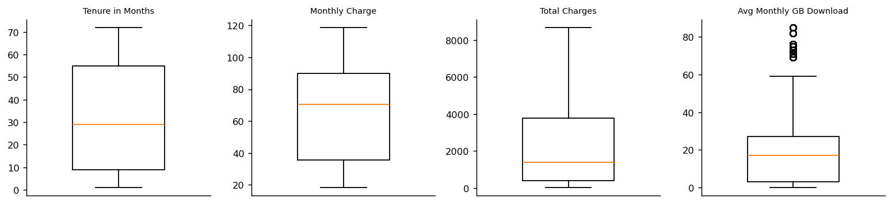
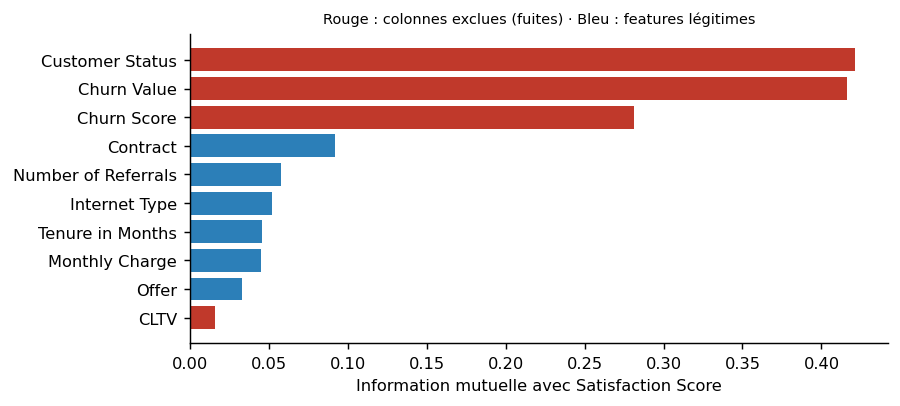
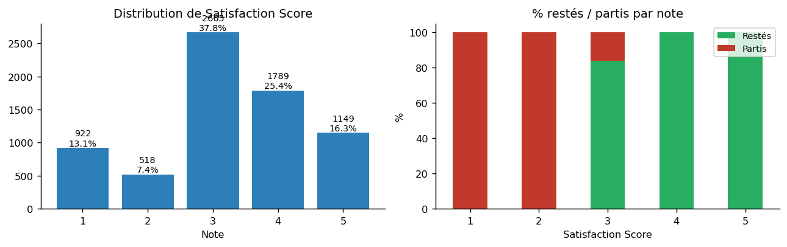
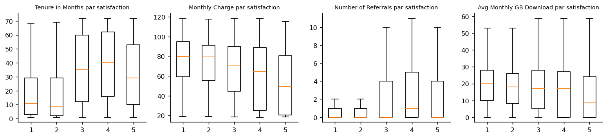
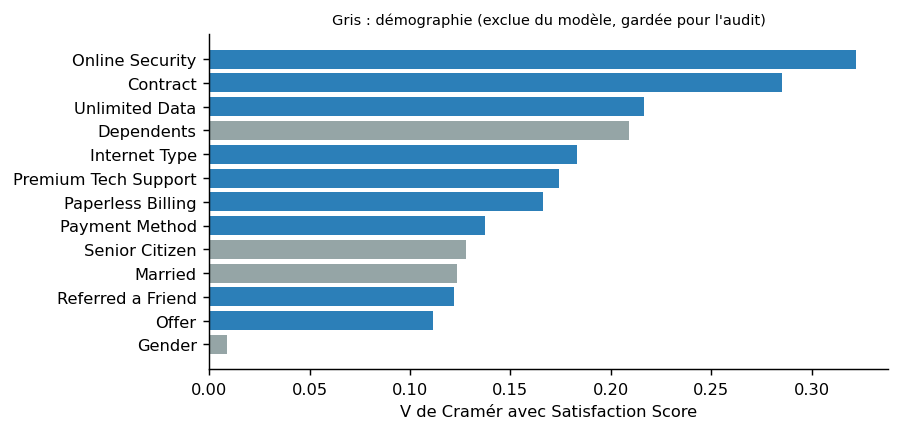
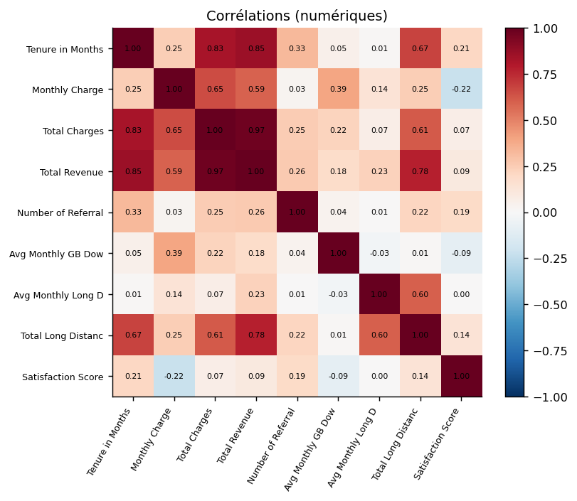
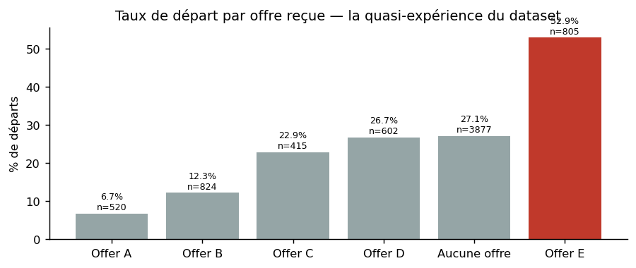

# Phase 2 — Compréhension des données

**En bref.** Cinq tables IBM Telco 11.1.3+ jointes sans perte (7043 clients × 51 colonnes).
Trois faits structurent tout le projet : (1) la note **3** pèse 38% de la base et 84% de ces
clients sont restés ; (2) le dataset **contient sa propre réponse** — satisfaction 1–2 → 100 % de départs,
4–5 → 0 % — donc toute colonne liée au churn est une fuite ; (3) les offres commerciales ont été
**ciblées** sur des clients fragiles, ce qui interdit toute lecture causale.

## 1. Sources et jointure

| Table | Lignes × colonnes | Clé | Contenu |
|---|---|---|---|
| demographics | 7 043 × 9 | Customer ID | genre, âge, situation familiale |
| location | 7 043 × 9 | Customer ID | ville, code postal, coordonnées |
| population | 1 671 × 3 | Zip Code | population du code postal |
| services | 7 043 × 30 | Customer ID | contrat, services, facturation, parrainage, **Satisfaction Score** |
| status | 7 043 × 11 | Customer ID | churn (label, valeur, score, catégorie, raison), CLTV |

Jointure interne sur `Customer ID`, `population` rattachée par `Zip Code`. Porte de contrôle :
**7043 lignes** après jointure, 0 doublon d'identifiant (test automatisé).

## 2. Dictionnaire des données

Statut de chaque colonne, décidé au registre de fuites (§ 4) : `feature` = variable explicative
candidate (27) · `audit_seulement` = exclue du modèle, utilisée pour l'audit d'équité
(12) · `fuite_*` = interdite (7) · `techniques` = identifiant ou constante (4) · `cible` (1).

| Colonne | Type | Manquants | Modalités | Exemple | Statut |
|---|---|---|---|---|---|
| Customer ID | object | 0.0% | 7043 | 8779-QRDMV | techniques |
| Gender | object | 0.0% | 2 | Male | audit_seulement |
| Age | int64 | 0.0% | 62 | 78 | audit_seulement |
| Under 30 | object | 0.0% | 2 | No | audit_seulement |
| Senior Citizen | object | 0.0% | 2 | Yes | audit_seulement |
| Married | object | 0.0% | 2 | No | audit_seulement |
| Dependents | object | 0.0% | 2 | No | audit_seulement |
| Number of Dependents | int64 | 0.0% | 10 | 0 | audit_seulement |
| Country | object | 0.0% | 1 | United States | techniques |
| State | object | 0.0% | 1 | California | techniques |
| City | object | 0.0% | 1106 | Los Angeles | audit_seulement |
| Zip Code | int64 | 0.0% | 1626 | 90022 | audit_seulement |
| Lat Long | object | 0.0% | 1679 | 34.02381, -118.156582 | techniques |
| Latitude | float64 | 0.0% | 1626 | 34.02381 | audit_seulement |
| Longitude | float64 | 0.0% | 1625 | -118.156582 | audit_seulement |
| Referred a Friend | object | 0.0% | 2 | No | feature |
| Number of Referrals | int64 | 0.0% | 12 | 0 | feature |
| Tenure in Months | int64 | 0.0% | 72 | 1 | feature |
| Offer | object | 55.0% | 5 | Offer E | feature |
| Phone Service | object | 0.0% | 2 | No | feature |
| Avg Monthly Long Distance Charges | float64 | 0.0% | 3584 | 0.0 | feature |
| Multiple Lines | object | 0.0% | 2 | No | feature |
| Internet Service | object | 0.0% | 2 | Yes | feature |
| Internet Type | object | 21.7% | 3 | DSL | feature |
| Avg Monthly GB Download | int64 | 0.0% | 50 | 8 | feature |
| Online Security | object | 0.0% | 2 | No | feature |
| Online Backup | object | 0.0% | 2 | No | feature |
| Device Protection Plan | object | 0.0% | 2 | Yes | feature |
| Premium Tech Support | object | 0.0% | 2 | No | feature |
| Streaming TV | object | 0.0% | 2 | No | feature |
| Streaming Movies | object | 0.0% | 2 | Yes | feature |
| Streaming Music | object | 0.0% | 2 | No | feature |
| Unlimited Data | object | 0.0% | 2 | No | feature |
| Contract | object | 0.0% | 3 | Month-to-Month | feature |
| Paperless Billing | object | 0.0% | 2 | Yes | feature |
| Payment Method | object | 0.0% | 3 | Bank Withdrawal | feature |
| Monthly Charge | float64 | 0.0% | 1585 | 39.65 | feature |
| Total Charges | float64 | 0.0% | 6540 | 39.65 | feature |
| Total Refunds | float64 | 0.0% | 500 | 0.0 | feature |
| Total Extra Data Charges | int64 | 0.0% | 16 | 20 | feature |
| Total Long Distance Charges | float64 | 0.0% | 6110 | 0.0 | feature |
| Total Revenue | float64 | 0.0% | 6996 | 59.65 | feature |
| Satisfaction Score | int64 | 0.0% | 5 | 3 | cible |
| Customer Status | object | 0.0% | 3 | Churned | fuite_consequence |
| Churn Label | object | 0.0% | 2 | Yes | fuite_consequence |
| Churn Value | int64 | 0.0% | 2 | 1 | fuite_consequence |
| Churn Score | int64 | 0.0% | 81 | 91 | fuite_modele_amont |
| CLTV | int64 | 0.0% | 3438 | 5433 | fuite_modele_amont |
| Churn Category | object | 73.5% | 5 | Competitor | fuite_disponibilite |
| Churn Reason | object | 73.5% | 20 | Competitor offered mor | fuite_disponibilite |
| Population | int64 | 0.0% | 1569 | 68701 | audit_seulement |

## 3. Qualité des données — cinq contrôles

**3.1 Valeurs manquantes.** Quatre colonnes, toutes à manquants **structurels** (le vide a un sens),
aucune imputation :

| Colonne | Manquants | Part | Nature | Traitement |
|---|---|---|---|---|
| Churn Category | 5174 | 73.5% | structurel | colonne exclue (fuite de disponibilité) |
| Churn Reason | 5174 | 73.5% | structurel | colonne exclue (fuite de disponibilité) |
| Offer | 3877 | 55.0% | structurel | catégorie « Aucune offre » |
| Internet Type | 1526 | 21.7% | structurel | catégorie « Pas d'internet » |

**3.2 Doublons.** 0 sur l'identifiant, 0 sur l'ensemble des colonnes hors identifiant.

**3.3 Valeurs aberrantes** (règle IQR × 1,5) — **conservées** : un client à 100 Go/mois ou à 120 $/mois
est un client réel, précisément le profil qu'un modèle de détraction doit voir ; les modèles retenus
(standardisation + régularisation, arbres) y sont robustes.

| Variable | Hors IQR × 1,5 |
|---|---|
| Tenure in Months | 0 |
| Monthly Charge | 0 |
| Total Charges | 0 |
| Total Revenue | 21 |
| Avg Monthly GB Download | 362 |

**3.4 Cohérence interne.** Ancienneté nulle : 0 client. Écart > 50 % entre `Total Charges` et
`Monthly Charge × Tenure` : 2 lignes — attendu (tarif variable sur la durée de vie), non corrigé, documenté.

**3.5 Colonnes constantes.** `Country`, `State` — base 100 % Californie. Supprimées.

## 4. Registre de fuites — l'étape la plus discriminante

**Le fait fondateur.**

| Satisfaction | Restés | Partis | % départ |
|---|---|---|---|
| 1.0 | 0.0 | 922.0 | 100.0 |
| 2.0 | 0.0 | 518.0 | 100.0 |
| 3.0 | 2236.0 | 429.0 | 16.1 |
| 4.0 | 1789.0 | 0.0 | 0.0 |
| 5.0 | 1149.0 | 0.0 | 0.0 |

Satisfaction 1–2 → **100 % de départs** ; 4–5 → **0 %**. Connaître le churn, c'est connaître la
cible. Or au moment où l'on veut détecter un détracteur, il n'est pas encore parti : l'information
n'existe pas. Toute colonne liée au churn est donc une fuite — et une fuite de trois natures :

| Nature | Définition | Colonnes | Décision |
|---|---|---|---|
| **Conséquence** | la colonne est un effet de la cible | `Churn Label`, `Churn Value`, `Customer Status` | exclues |
| **Disponibilité** | la colonne n'existe que pour une partie de la population — sa présence trahit la réponse | `Churn Category`, `Churn Reason` (5 174 vides = clients restés) | exclues |
| **Modèle amont** | la colonne est la sortie d'un autre modèle (IBM SPSS) | `Churn Score`, `CLTV` | exclues des features ; `CLTV` admise en **couche de décision** (phase 5 § 3) |

`Churn Score` et `CLTV` par niveau de satisfaction :

| Satisfaction | Churn Score moyen | CLTV moyenne |
|---|---|---|
| 1.0 | 82.0 | 4158.0 |
| 2.0 | 82.0 | 4104.0 |
| 3.0 | 55.0 | 4473.0 |
| 4.0 | 50.0 | 4514.0 |
| 5.0 | 50.0 | 4381.0 |

`Churn Score` passe de ~82 à ~50 : une prédiction déguisée en donnée. `CLTV` est plate — peu
informative comme feature, mais légitime pour pondérer *qui appeler* parmi les détracteurs prédits.

**Quantifier au lieu d'affirmer.** Information mutuelle de chaque colonne avec la cible :

| Colonne | Information mutuelle | Statut |
|---|---|---|
| Customer Status | 0.421 | fuite_consequence |
| Churn Value | 0.416 | fuite_consequence |
| Churn Score | 0.281 | fuite_modele_amont |
| Contract | 0.092 | feature |
| Number of Referrals | 0.058 | feature |
| Internet Type | 0.052 | feature |
| Tenure in Months | 0.046 | feature |
| Monthly Charge | 0.045 | feature |
| Offer | 0.033 | feature |
| CLTV | 0.016 | fuite_modele_amont |

Les colonnes exclues portent une information sans commune mesure avec les features légitimes.
C'est la mesure qui justifie l'exclusion, pas l'intuition.

**Contre-exemple publié.** Mustafa et al. (2021) annoncent 98 % d'exactitude en prédisant le churn
avec la note NPS et la catégorie NPS parmi les features, alors que leur cible en dérive. Leurs modèles
linéaires font 41 %, leurs arbres 98 % : cet écart est la **signature** d'une variable qui fuit. On
applique ce test en phase 4 § 5.

**Démographie et géographie : exclues du modèle, gardées pour l'audit.** `Gender`, `Age`, `Under 30`, `Senior Citizen`, `Married`, `Dependents`, `Number of Dependents`, `City`, `Zip Code`, `Latitude`, `Longitude`, `Population`.
Précédent : Elero et al. (2026) excluent délibérément les démographiques. Position cohérente avec le
métier (les leviers actionnables sont contractuels) et avec l'énoncé § 4.7 (le code postal est un
proxy socio-économique). Le coût de cette exclusion est **chiffré** en phase 5 § 5, et la mesure de ce
que les features retenues révèlent malgré tout de ces attributs en phase 5 § 7.

## 5. Analyse exploratoire

**5.1 La cible.**

| Note | Clients | Part |
|---|---|---|
| 1 | 922 | 13.1% |
| 2 | 518 | 7.4% |
| 3 | 2665 | 37.8% |
| 4 | 1789 | 25.4% |
| 5 | 1149 | 16.3% |

La note 3 pèse **2665 clients, 37.8% de la base**, et 2236 d'entre eux (84%) sont toujours clients.
Où les placer dans la grille NPS décide de tout le reste (phase 3 § 1).

**5.2 Numériques par niveau de satisfaction.** L'ancienneté et le nombre de parrainages croissent
nettement avec la satisfaction ; la charge mensuelle varie peu.

**5.3 Catégorielles : force d'association.** Le type de contrat et l'offre reçue dominent ; les
variables démographiques (gris) sont faiblement associées à la satisfaction — leur exclusion devrait
donc coûter peu (vérifié en phase 5).

**5.4 Corrélations entre numériques.** `Total Charges`, `Total Revenue` et `Tenure in Months` sont
mécaniquement liés (le total cumule le mensuel sur la durée). Traité en phase 3 § 3 (colinéarité).

**5.5 La quasi-expérience du dataset : `Offer`.**

| Offre | Clients | Taux de départ | Satisfaction moy. |
|---|---|---|---|
| Offer A | 520 | 6.7% | 3.55 |
| Offer B | 824 | 12.3% | 3.48 |
| Offer C | 415 | 22.9% | 3.32 |
| Offer D | 602 | 26.7% | 3.25 |
| Aucune offre | 3877 | 27.1% | 3.24 |
| Offer E | 805 | 52.9% | 2.81 |

Les clients ayant reçu l'**offre E partent deux fois plus** que ceux qui n'ont rien reçu. Lire
« l'offre E fait fuir » serait une erreur : c'est un **biais d'indication** — l'offre a été proposée
à des clients déjà en difficulté, comme un médicament à des patients déjà malades. On ne lit pas un
effet causal dans des données observationnelles ; ce constat fonde les limites du ciblage (phase 5 § 8).

## 6. Enrichissement externe : décision

L'énoncé autorise des sources externes (recensement par code postal, benchmarks télécom) à condition
d'en justifier la pertinence métier. **Décision : aucune.** Deux raisons. (1) Le dataset contient déjà
la seule variable de contexte géographique disponible à la maille du client (`Population` du code
postal), et elle est exclue du modèle au titre de l'équité — ajouter des revenus médians par code
postal reviendrait à réintroduire par la fenêtre le proxy socio-économique qu'on a sorti par la porte
(énoncé § 4.7). (2) Le dataset est fictif : un enrichissement réel sur des coordonnées californiennes
fictives n'aurait aucune validité. Les **benchmarks NPS télécom** publiés sont en revanche utilisés
comme corroboration externe de la construction de la cible (phase 3 § 1).

## Décisions prises dans cette phase

| Décision | Justification | Où c'est vérifié |
|---|---|---|
| Jointure interne, porte de contrôle à 7 043 lignes | aucune perte tolérée ; un client sans ligne de services est une erreur, pas un cas | test `test_jointure_sans_perte` |
| Manquants structurels → catégorie explicite, jamais imputés | le vide a un sens métier (pas d'offre, pas d'internet) ; imputer fabriquerait de l'information | § 3.1 |
| Aberrantes conservées | profils réels ; robustesse des modèles retenus | § 3.3 |
| Toute colonne liée au churn exclue, en trois natures nommées | fait fondateur : satisfaction ⇔ churn ; information mutuelle mesurée | § 4, test `test_aucune_colonne_churn_dans_les_features` |
| Démographie et géographie hors modèle, audit seulement | leviers non actionnables ; proxies d'attributs protégés (énoncé § 4.7) | § 4, phase 5 § 7 |
| Aucun enrichissement externe | réintroduirait un proxy socio-économique ; dataset fictif | § 6 |
