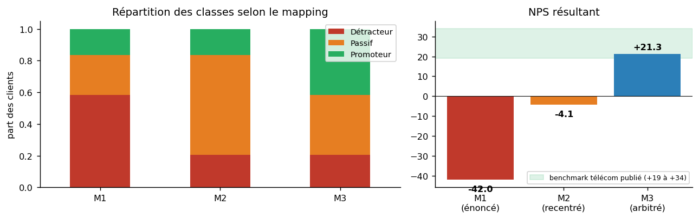
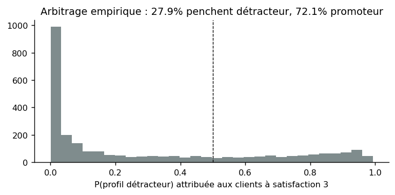
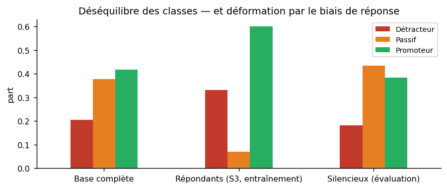

# Phase 3 — Préparation des données

**En bref.** La cible NPS est construite à partir de la satisfaction 1–5 par trois mappings ; le
mapping de l'énoncé donne un NPS de **-42**, hors de toute plausibilité sectorielle, parce qu'il
envoie les 2665 clients « 3 » chez les détracteurs. Un arbitrage **empirique** (modèle entraîné sur
les seuls extrêmes) montre qu'ils penchent à 72% côté promoteur ; le bloc rejoint les Passifs
(NPS **+21**). 18 variables numériques et 17 catégorielles sont retenues, chacune avec l'hypothèse
qui la justifie ; le déséquilibre est traité par pondération de classes, choix comparé à quatre
alternatives ; tout le préprocessing vit dans un `Pipeline` scikit-learn.

## 1. Construction de la cible NPS

Le dataset donne une satisfaction de 1 à 5. Le NPS a trois classes. Personne ne fournit la
traduction : c'est à nous de la construire et de la défendre.

| | Détracteur | Passif | Promoteur | NPS | Logique |
|---|---|---|---|---|---|
| **M1** | 1, 2, 3 | 4 | 5 | **-42.0** | mapping baseline de l'énoncé (fidèle à l'échelle : 3/5 ≈ 5/10 = détracteur) |
| **M2** | 1, 2 | 3, 4 | 5 | **-4.1** | recentré : le 3 est le milieu, donc passif |
| **M3** | 1, 2 | 3 | 4, 5 | **+21.3** | **retenu** — le « 3 » arbitré par les données (§ 1.2), le « 4 » reclassé par hypothèse d'échelle (§ 1.3) |

**1.1 Pourquoi M1 pose problème.** M1 est le mapping *fidèle à l'échelle* — et c'est précisément pour
ça qu'il est faux : une échelle à 5 points compressée dans les bandes NPS envoie 58% de la base chez
les détracteurs, dont 2 665 clients à « 3 » qui, à 84%, sont restés. Un NPS de -42 est à 60–75 points des
benchmarks télécom publiés (+19 à +34 ; voir la note de sources ci-dessous). Ce n'est pas un
résultat, c'est un signal d'alerte sur la construction.

> **D'où vient le « +19 à +34 », et ce qu'il vaut.** Trois compilations commerciales de NPS
> télécom, consultées en septembre 2026 :
> [CustomerGauge](https://customergauge.com/benchmarks/blog/telecommunications-nps-benchmarks-and-cx-trends),
> [QuestionPro](https://www.questionpro.com/blog/nps-benchmarks/) et
> [Survicate](https://survicate.com/nps-benchmarks/). **Pertinence métier** : marché américain, le
> même que celui du dataset, et NPS relationnel — la même mesure que celle qu'on reconstruit.
> **Réserves, qui comptent autant que le chiffre** : ce sont des sources d'éditeurs, pas de la
> littérature relue ; leur dispersion est large (19, 31, 34, voire 54 selon l'éditeur et l'année) ;
> et notre NPS est calculé sur une satisfaction de 1 à 5, pas sur une intention de recommandation
> de 0 à 10 (hypothèse 1 de la phase 1). Ce repère sert donc à qualifier M1 d'**implausible**, à
> l'ordre de grandeur près — jamais à valider un mapping ni à servir de cible.

**1.2 L'arbitrage empirique des « 3 »** (méthode d'Elero et al., 2026, qui l'appliquent aux notes 7 et 8).
Plutôt que de décider où vont les 2665 clients ambigus, on demande aux données :

1. entraîner un modèle **uniquement sur les extrêmes non ambigus** — satisfaction 1–2 contre 4–5
   (4378 clients), avec les seules features légitimes ;
2. contrôler qu'il sépare ces extrêmes : **80.1%** d'exactitude en validation croisée, contre
   **67.1%** pour la classe majoritaire. Le modèle apprend donc quelque chose
   sans être parfait, ce qui est exactement le comportement attendu. *(Ce n'est pas une preuve
   d'absence de fuite, et l'ancienne rédaction le laissait croire en comparant ce chiffre à des
   exactitudes 3 classes de la littérature, qui ne sont pas comparables à un problème binaire. Le
   test formel de fuite est en phase 4 § 5.)* ;
3. faire passer les 2665 clients à « 3 », jamais vus, à travers ce modèle.

**Résultat : 27.9% des « 3 » ressemblent à des détracteurs**, contre 72.1% qui ressemblent aux 4–5.
Le bloc rejoint les **Passifs**.

**La règle de décision, et son asymétrie assumée.** La seule question posée au modèle d'arbitrage
est : *les clients à 3 sont-ils majoritairement des détracteurs ?* Si la part dépasse
50%, le bloc rejoint les Détracteurs ; sinon il reste **Passif**. Promoteur n'est
volontairement **pas** une issue possible, et il faut le dire plutôt que de le laisser deviner : une
note de 3 sur 5 est le milieu exact de l'échelle, et rien dans le NPS ne permet de promouvoir un
milieu d'échelle au rang de promoteur. La mesure sert donc à **écarter l'hypothèse de l'énoncé**
(« ces clients sont des détracteurs »), pas à choisir librement parmi les trois classes ; le
complément de 72.1% dit que ces clients ressemblent aux 4–5, pas qu'ils en sont.

La décision n'est pas sur le fil : il manque 22.1% de part détractrice pour que le bloc
bascule. Un test automatisé verrouille cette valeur, parce qu'un glissement silencieux de ce seul
chiffre changerait le NPS de référence de plus de 60 points.

**1.3 L'autre décision, celle du « 4 » — et d'où viennent vraiment les +63 points.**
L'arbitrage des « 3 » ne fait pas tout le chemin, et présenter M3 comme « arbitré par les données »
sans plus de précision laisserait croire le contraire. Le passage de -42.0 à +21.3 se décompose en
**deux décisions distinctes**, dont une seule est empirique :

| Étape | Décision | Nature | NPS |
|---|---|---|---|
| Départ | grille de l'énoncé : 1–2–3 Détracteur, 4 Passif, 5 Promoteur | hypothèse de l'énoncé | **-42.0** |
| 1 | les 2 665 clients à « 3 » quittent les Détracteurs pour les Passifs | **mesurée** (§ 1.2) | **-4.1** |
| 2 | les clients à « 4 » passent de Passif à Promoteur | **hypothèse d'échelle**, assumée ici | **+21.3** |

La décision 2 n'est pas mesurée, et voici l'argument qui la porte. Sur une échelle à 5 points, la
note 4 correspond à « satisfait » et se projette vers 8–9 sur une échelle en 10 points, donc dans la
bande Promoteur du NPS (9–10) ou à sa frontière immédiate (8 = Passif). Deux éléments font pencher
vers Promoteur : **aucun** client noté 4 n'a quitté l'opérateur, exactement comme les 5 ; et Elero
et al. (2026) traitent de la même façon la borne haute de leur échelle. Deux réserves, qui restent
entières : une échelle à 5 points n'a pas de position pour le « 8 » qui sépare Passif de Promoteur,
et la note 4 concerne 25% de la base — c'est donc la décision la plus lourde de l'étude après
celle du « 3 ». La variante prudente, qui laisse le « 4 » chez les Passifs, est **M2** (-4.1) :
elle est calculée, publiée et incluse dans l'étude de sensibilité (phase 5 § 5.1), précisément pour
qu'un lecteur qui refuse cette hypothèse puisse lire le travail avec son propre mapping.

**1.4 Le piège évité — la circularité.** Il était tentant d'étiqueter *chaque* « 3 » par la prédiction
du modèle. Ce serait une faute : la cible deviendrait une fonction des features, et le modèle aval
réapprendrait sa propre sortie — une circularité cousine de la fuite `Churn Score`. On tranche donc
**le bloc** par la mesure agrégée, et on conserve la probabilité individuelle comme simple **indicateur
métier** (« ce passif a un profil de détracteur à X % »), affiché dans l'application, jamais utilisé à
l'entraînement.

**1.5 Ce que l'énoncé suggérait et qu'on a refusé.** Enrichir la cible par `Churn Value` ou `CLTV`
transformerait le projet en modèle de churn déguisé (phase 2 § 4). Enrichir par l'ancienneté rendrait
la cible fonction d'une feature (même circularité qu'en 1.4). Le **bruit réaliste** suggéré par
l'énoncé est traité en phase 5 § 5.2 comme test de robustesse. Ce bruit est **ordinal**, et ce choix
est le point de la section : dans une vraie enquête, un promoteur mal mesuré devient passif bien plus
souvent que détracteur, et ce sont les notes du milieu qui sont les plus fragiles. On bascule donc
vers une classe adjacente dans 80 % des cas et vers la classe opposée dans 20 %, avec une exposition
trois fois plus forte pour les clients notés 3. Un bruit uniforme — toutes les erreurs équiprobables,
y compris promoteur → détracteur — est le moins réaliste possible sur une cible ordonnée ; il est
conservé en second, comme borne pessimiste.

**1.6 Limites du label construit.** L'énoncé demande explicitement de discuter les limites de la
cible qu'on fabrique (§ 4.5). Trois, par ordre de gravité.

1. **La satisfaction n'est pas une intention de recommander.** Le NPS mesure la propension à
   recommander à un tiers, la satisfaction une expérience vécue. Les deux corrèlent, ils ne
   s'identifient pas. C'est l'hypothèse 1 de la phase 1, et elle est indépassable avec ce dataset.
2. **La note a probablement été rendue cohérente avec le churn par le producteur du dataset.** Le
   fait fondateur — 100 % de départs chez les 1–2, 0 % chez les 4–5 — ne s'observe dans aucune
   enquête réelle. L'interprétation retenue ailleurs dans l'étude (« le churn est une conséquence de
   l'insatisfaction ») n'est pas la seule compatible : l'hypothèse inverse, une note dérivée du
   statut de churn, l'est tout autant et nous ne pouvons pas les départager. Conséquence à assumer :
   notre modèle NPS et un modèle de churn partagent largement leurs drivers, et les performances
   mesurées ici sont une **borne haute**. Sur de vraies réponses, plus bruitées, il faut s'attendre à
   une dégradation de l'ordre de celle que mesure le test de bruit d'étiquettes (phase 5 § 5.2).
3. **Seule la note 3 apporte une information non réductible au churn.** Parmi les 2665 clients à « 3 »,
   2236 sont restés et les autres sont partis : c'est le seul endroit du jeu où la note et le statut
   de départ ne se déduisent pas l'un de l'autre. C'est aussi pourquoi l'arbitrage de ce bloc a reçu
   autant d'attention, et pourquoi la classe Passif est la plus difficile à prédire (phase 5 § 2).

## 2. Nettoyage

- Manquants structurels (`Offer`, `Internet Type`) → catégorie explicite (phase 2 § 3).
- Manquants accidentels (aucun dans ce dataset, mais l'application en produira) → imputation **dans
  le pipeline** (médiane / modalité la plus fréquente), jamais en amont, pour qu'aucune statistique
  calculée sur tout le jeu ne fuie vers l'évaluation.
- Aberrantes conservées ; colonnes constantes supprimées.

## 3. Feature engineering — chaque variable adossée à une hypothèse

**3.1 Variables brutes retenues et pourquoi.**

| Variable(s) | Pourquoi elle devrait aider à prédire le NPS |
|---|---|
| Contract | l'engagement contractuel est le premier marqueur de la relation ; un client mensuel peut partir demain |
| Tenure in Months | l'ancienneté cumule l'expérience vécue ; les premiers mois concentrent les déceptions |
| Offer | un geste commercial reçu signale à la fois une politique de l'opérateur et un client jugé fragile |
| Number of Referrals | recommander est le comportement que le NPS mesure : proxy comportemental direct, observable, antérieur |
| Monthly Charge | le prix payé chaque mois ; la perception du rapport qualité-prix passe par lui |
| Total Charges / Total Revenue | l'intensité économique cumulée de la relation |
| Total Refunds / Total Extra Data Charges / Total Long Distance Charges | traces d'incidents de facturation et d'usages hors forfait — sources classiques de friction |
| Avg Monthly GB Download / Avg Monthly Long Distance Charges | intensité d'usage : un gros consommateur subit davantage les défauts de qualité |
| Internet Service / Internet Type | la fibre et le DSL n'ont ni la même qualité ni la même clientèle (Elero : vitesse et stabilité = premiers drivers) |
| Services optionnels (sécurité, sauvegarde, protection, support premium, streaming, données illimitées) | la composition du bouquet dit ce que le client attend et ce qu'il a accepté de payer |
| Phone Service / Multiple Lines | périmètre du service souscrit |
| Paperless Billing | proxy d'engagement numérique cité par l'énoncé |
| Payment Method | le mode de paiement révèle l'automatisation de la relation (auto-pay) et le canal préféré |

**3.2 Variables dérivées.**

| Variable dérivée | Hypothèse métier |
|---|---|
| `nb_services` | intensité de la relation commerciale : plus de services, plus de raisons de rester — ou de se plaindre |
| `charge_par_service` | perception du rapport qualité-prix : ce que coûte chaque service souscrit |
| `tranche_anciennete` | l'insatisfaction d'un nouveau client (attentes déçues) n'a pas la même nature que celle d'un ancien (usure) |
| `a_recu_offre` | un geste commercial a-t-il été fait ? (indicateur binaire, complémentaire du type d'offre) |
| `a_eu_remboursement` | trace d'un incident de facturation reconnu par l'opérateur |
| `a_frais_supplementaires` | trace d'un dépassement de forfait — friction tarifaire |
| `revenu_par_mois` | intensité économique moyenne de la relation, indépendante de l'ancienneté |
| `a_parraine` | proxy comportemental direct de la recommandation, donc du NPS lui-même ; comportement passé observable, pas une conséquence de la note |
| `paiement_automatique` | auto-pay (énoncé § 4.3) : un paiement automatisé signale une relation installée et sans friction |

**3.3 Variables retenues.** **18 numériques** : `Number of Referrals`, `Tenure in Months`, `Avg Monthly Long Distance Charges`, `Avg Monthly GB Download`, `Monthly Charge`, `Total Charges`, `Total Refunds`, `Total Extra Data Charges`, `Total Long Distance Charges`, `Total Revenue`, `nb_services`, `charge_par_service`, `a_recu_offre`, `a_eu_remboursement`, `a_frais_supplementaires`, `revenu_par_mois`, `a_parraine`, `paiement_automatique`.
**17 catégorielles** : `Offer`, `Phone Service`, `Multiple Lines`, `Internet Service`, `Internet Type`, `Online Security`, `Online Backup`, `Device Protection Plan`, `Premium Tech Support`, `Streaming TV`, `Streaming Movies`, `Streaming Music`, `Unlimited Data`, `Contract`, `Paperless Billing`, `Payment Method`, `tranche_anciennete`.

**3.4 Variables écartées et pourquoi.** Démographie (`Gender`, `Age`, `Senior Citizen`, `Married`,
`Dependents`…) et géographie (`Zip Code`, `Latitude`, `Longitude`, `Population`, `City`) : hors modèle
par décision d'équité (phase 2 § 4), **coût chiffré** en phase 5 § 5 ; `Referred a Friend` : redondant
avec `Number of Referrals` (recodé en `a_parraine`) ; identifiants et constantes.

**3.5 Colinéarité (VIF).**

| Variable | VIF |
|---|---|
| Total Revenue | > 1 000 (identité comptable) |
| Total Charges | > 1 000 (identité comptable) |
| Total Refunds | > 1 000 (identité comptable) |
| Total Extra Data Charges | > 1 000 (identité comptable) |
| Total Long Distance Charges | > 1 000 (identité comptable) |
| revenu_par_mois | 86.5 |
| Monthly Charge | 68.2 |
| nb_services | 19.4 |
| Avg Monthly Long Distance Charges | 18.7 |
| Tenure in Months | 7.7 |
| charge_par_service | 4.9 |
| a_eu_remboursement | 4.3 |
| a_frais_supplementaires | 3.1 |
| a_parraine | 2.1 |
| Number of Referrals | 2.1 |
| Avg Monthly GB Download | 1.3 |
| paiement_automatique | 1.0 |
| a_recu_offre | 1.0 |

`Total Charges`, `Total Revenue`, `Total Refunds`, `Total Extra Data Charges` et `Total Long Distance
Charges` sont liés par une **identité comptable** (le revenu total est la somme des autres) : VIF
infini par construction. **Décision : conservées.** Les modèles linéaires du catalogue sont
régularisés (L2), ce qui absorbe la colinéarité ; les arbres y sont insensibles. La colinéarité
brouillerait l'interprétation coefficient par coefficient : l'interprétabilité (phase 5 § 6) lit donc
les variables corrélées comme un bloc.

## 4. Déséquilibre des classes

Deux déséquilibres se superposent. Dans la base, le Passif domine (38%) et le Détracteur est
minoritaire (20%). Mais le modèle apprend sur les **répondants**, où le biais de réponse (phase 4 § 2)
inverse la structure : 33% de Détracteurs, 7% de Passifs seulement. Le Passif est donc à la
fois la classe la plus fréquente à l'évaluation et la plus rare à l'entraînement — c'est **elle** qu'un
modèle abandonne en premier, et c'est ce que le rappel par classe surveille (phase 5 § 1).

**Stratégies comparées** (baseline logistique, S3/M3, évaluées sur les silencieux) :

| Stratégie | Kappa | Macro-F1 | Rappel Dét. | Rappel Passif | Rappel Prom. | Précision Dét. |
|---|---|---|---|---|---|---|
| aucune (logistique non pondérée) | 0.365 | 0.380 | 0.764 | 0.012 | 0.793 | 0.399 |
| pondération de classes 'balanced' (retenue) | 0.370 | 0.497 | 0.785 | 0.323 | 0.559 | 0.395 |
| sur-échantillonnage aléatoire | 0.372 | 0.498 | 0.776 | 0.329 | 0.560 | 0.396 |
| SMOTE (k=5) | 0.357 | 0.489 | 0.737 | 0.323 | 0.565 | 0.388 |
| sous-échantillonnage aléatoire | 0.323 | 0.479 | 0.691 | 0.418 | 0.446 | 0.372 |

**Décision : pondération de classes `balanced`.** Elle est appliquée à tous les modèles du
catalogue qui l'acceptent (ou par `sample_weight` équivalent). Le rééchantillonnage (SMOTE,
sur/sous-échantillonnage) n'apporte pas de gain systématique ici et fabrique des clients
synthétiques dans un espace one-hot où l'interpolation n'a pas de sens métier ; la pondération est
plus simple, sans hyperparamètre, et laisse les données intactes.

## 5. Pipeline de préparation

Tout est encapsulé dans un `Pipeline` scikit-learn (`ColumnTransformer`) :

- numériques → imputation médiane → `StandardScaler` **pour les modèles à distance ou linéaires
  seulement** (logistique, ordinale, ridge, KNN, SVM, MLP, Naive Bayes) ; rien pour les arbres — deux
  préparations, pas un compromis ;
- catégorielles → imputation mode → `OneHotEncoder(handle_unknown='ignore')`, pour que
  l'application tolère une modalité jamais vue sans planter ;
- CatBoost reçoit les catégorielles **brutes** : c'est l'hypothèse qu'il teste (phase 4 § 3).

Rien n'est transformé hors du pipeline. C'est ce qui rend le modèle sérialisable d'un bloc et exempt
de fuite entraînement → test. Le découpage répondants / silencieux est décrit en phase 4 § 2.

## Décisions prises dans cette phase

| Décision | Justification | Où c'est vérifié |
|---|---|---|
| Cible M3 : 1–2 Détracteur, 3 Passif, 4–5 Promoteur | arbitrage empirique des « 3 » ; NPS dans la fourchette sectorielle | § 1.2, test `test_mappings_et_nps` |
| Aucun étiquetage individuel des « 3 » par le modèle | évite la circularité cible ← features | § 1.3, test `test_indicateur_profil_detracteur_reserve_aux_ambigus` |
| Neuf variables dérivées, chacune avec son hypothèse | exigence § 4.3 de l'énoncé | § 3.2 |
| Colinéarité conservée | régularisation L2 et arbres insensibles ; lecture par blocs | § 3.5 |
| Pondération de classes plutôt que rééchantillonnage | comparaison de cinq stratégies ; simplicité | § 4 |
| Préprocessing dans le Pipeline uniquement | aucune fuite de statistiques ; sérialisation d'un bloc | § 5, test `test_modele_tolere_entrees_vides_et_modalites_inconnues` |
