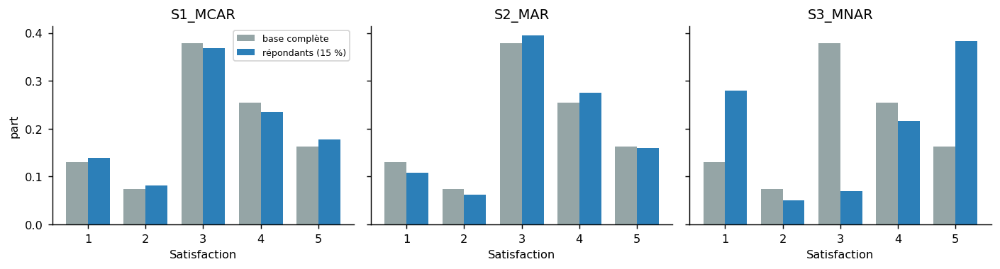
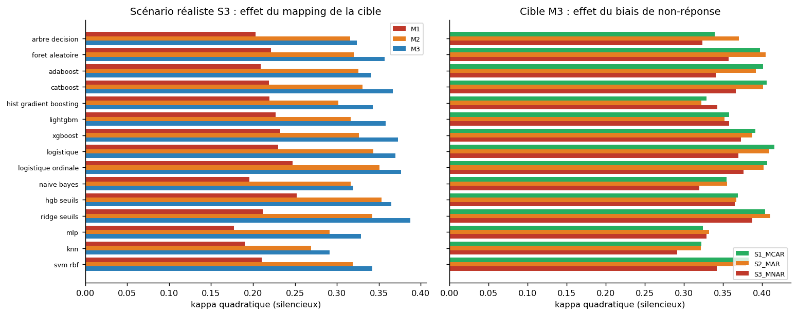
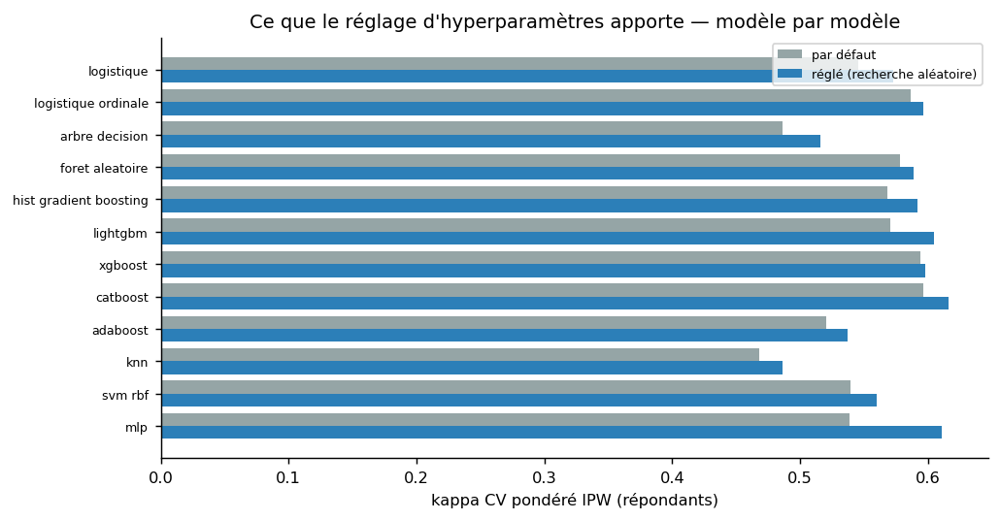
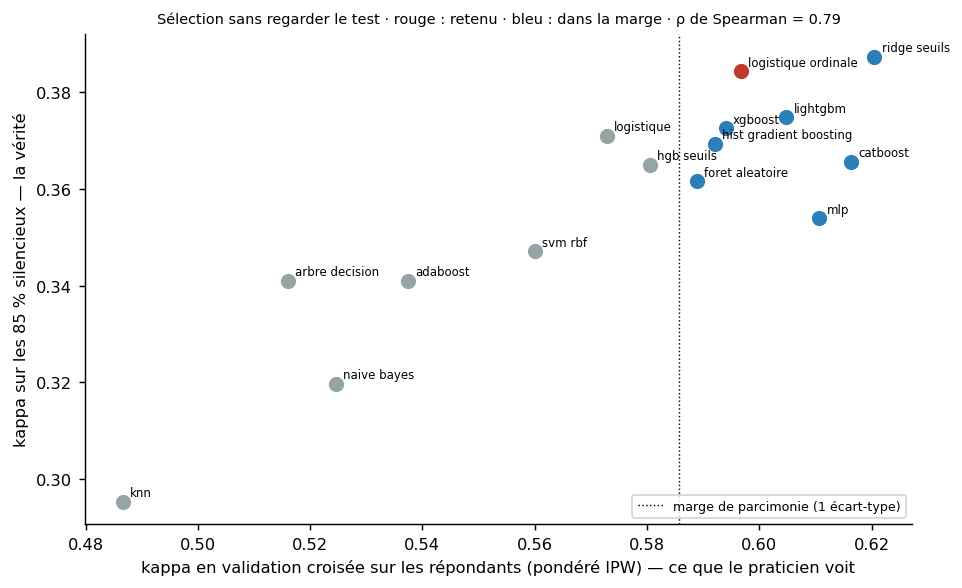

# Phase 4 — Modélisation

**En bref.** Le découpage 15/85 est **simulé avec un biais de non-réponse** (trois scénarios, du plus
optimiste au plus réaliste) et le modèle est toujours entraîné sur les répondants, évalué sur les
silencieux dont on connaît la vérité. **Quinze modèles en sept familles**, couvrant les trois
formulations de l'énoncé, sont comparés sur 3 scénarios × 3 mappings, puis réglés et sélectionnés **par
validation croisée sur les répondants** — sans jamais regarder les silencieux — avec une règle de
parcimonie. Retenu : **logistique ordinale** (réglée). Le meilleur kappa CV brut était
ridge seuils ; le meilleur sur les silencieux est ridge seuils. L'écart entre ce
que la validation croisée promet (0.61) et ce que les silencieux donnent (0.38) est le coût mesuré du biais de réponse.

## 1. Les trois formulations, instanciées et comparées

| Formulation | Comment elle traite l'ordre des classes | Modèles du catalogue |
|---|---|---|
| Classification nominale | ne le voit pas ; l'ordre est réintroduit par la métrique (kappa quadratique) et par la pondération | logistique, arbre, forêt, boosting (×5), KNN, SVM, MLP, Naive Bayes |
| Classification ordinale | l'impose par la structure : une variable latente et deux seuils | logistique ordinale (mord, all-threshold) |
| Régression 1–5 puis seuillage | exploite la note fine à l'entraînement ; seuils optimisés sur le kappa | ridge + seuils, HGB + seuils |

Résultat par formulation (meilleur modèle de chaque, S3/M3) :

| Formulation | Modèles | Meilleur (CV) | Kappa CV IPW | Kappa silencieux | Macro-F1 silencieux |
|---|---|---|---|---|---|
| classification nominale | 12 | catboost | 0.616 | 0.366 | 0.440 |
| classification ordinale | 1 | logistique_ordinale | 0.597 | 0.384 | 0.490 |
| régression 1-5 puis seuillage | 2 | ridge_seuils | 0.621 | 0.387 | 0.478 |

Lecture : les trois formulations arrivent à des kappas voisins ; celles qui **exploitent l'ordre**
(ordinale, régression à seuils) sont construites pour la métrique qui respecte l'ordre et en tirent un
léger avantage, avec un **profil par classe** propre à chacune (rappels Détracteur et Passif dans le
tableau de sélection, § 6.2). Le choix final se fait sur la mesure (§ 6), et l'évaluation métier
(phase 5 § 3) vérifie que le classement des appels n'en souffre pas.

## 2. Protocole de validation 15 % / 85 %

Un `train_test_split` stratifié rate l'intention de l'énoncé : les répondants à une enquête NPS ne
sont pas un échantillon aléatoire — les très mécontents et les très contents répondent plus. C'est
du **MNAR** (*missing not at random*). L'avantage rare de ce dataset : on connaît la satisfaction des
100 %, donc on peut simuler le biais et **mesurer ce qu'il coûte**, ce qu'aucun praticien ne peut
faire en production.

| Scénario | Mécanisme de réponse | Ce qu'il mesure |
|---|---|---|
| S1 — MCAR | 15 % tirés au hasard | borne haute optimiste |
| S2 — MAR | propension = f(ancienneté, facture dématérialisée, engagement) | biais de covariables seul |
| S3 — MNAR | propension = f(covariables, **écart de la satisfaction au centre**) | le cas réaliste, retenu pour le modèle final |

Dans tous les cas : **entraînement sur les 15 % répondants, évaluation sur les 85 % silencieux**.
Validation croisée stratifiée à 5 plis à l'intérieur des 15 % pour le réglage et la sélection.

| Scénario | Taux de réponse | Satisf. base | Satisf. répondants | Extrêmes base | Extrêmes répondants |
|---|---|---|---|---|---|
| S1_MCAR | 15.2% | 3.245 | 3.230 | 36.8% | 39.7% |
| S2_MAR | 15.4% | 3.245 | 3.316 | 36.8% | 33.0% |
| S3_MNAR | 15.3% | 3.245 | 3.373 | 36.8% | 71.4% |

Sous S3, la part des notes extrêmes passe de **37% dans la base à 71% chez les répondants** : le
modèle apprend sur une population qui ne ressemble pas à celle sur laquelle il sera appliqué.
Kannan et al. (2022) observent un taux de réponse réel de **2,6 %** : notre 15 % est optimiste.

**Repondération par l'inverse de la propension (IPW).** La propension à répondre est **estimée**
comme un praticien le ferait — logistique P(répondre | covariables) sur les 7 043 clients, hypothèse
MAR (poids entre 0.51 et 3.26). Ces poids servent (a) à pondérer la validation croisée pour
estimer la performance sur la population entière plutôt que sur les répondants, (b) en test comme
poids d'entraînement : kappa 0.384 sans → 0.371 avec, **retenu : sans IPW**. L'effet est faible parce
que la propension vraie sous S3 dépend de la satisfaction, que l'estimation MAR ne voit pas : c'est
la limite structurelle de l'IPW face au MNAR. Le cadre canonique serait le modèle de sélection de
Heckman, qui exige une restriction d'exclusion introuvable ici.

## 3. Le catalogue — quinze modèles, sept familles, une raison chacun

L'énoncé demande une baseline puis au moins deux familles justifiées ; les quatre études de
référence en comparent six à neuf. On ne compare pas des algorithmes pour remplir un tableau : chaque
modèle est là pour tester une **hypothèse** sur les données.

| Famille | Modèle | Formulation | Pourquoi il est là | Hypothèse testée | Référence |
|---|---|---|---|---|---|
| Linéaire | `logistique` | classification nominale | la baseline exigée par l'énoncé (§ 4.5) ; ses coefficients sont une explication exacte et additive | les frontières entre classes sont proches du linéaire dans l'espace des variables standardisées | Chong et al. 2023 (LR 79,2 % sur ce dataset) ; Kannan et al. 2022 |
| Linéaire | `logistique_ordinale` | classification ordinale | la formulation ordinale demandée au § 2 : un seul vecteur de coefficients et deux seuils (mord, all-threshold), trois fois moins de paramètres que la multinomiale | l'ordre Détracteur < Passif < Promoteur est porté par une seule direction latente | énoncé § 5 (mord) ; Agresti, Categorical Data Analysis |
| Régression + seuils | `ridge_seuils` | régression 1-5 puis seuillage | la troisième formulation de l'énoncé, en version linéaire : régression ridge sur la note 1-5, puis deux seuils optimisés sur le kappa quadratique | la note fine 1-5 contient plus d'information que les trois classes et mérite d'être exploitée à l'entraînement | énoncé § 2 (« regression with thresholding ») |
| Régression + seuils | `hgb_seuils` | régression 1-5 puis seuillage | même formulation avec un régresseur non linéaire (gradient boosting d'histogrammes) | la relation variables → note comporte des interactions qu'un modèle linéaire ne capte pas | énoncé § 2 |
| Arbres et bagging | `arbre_decision` | classification nominale | des règles lisibles par un non-technicien ; le modèle de Kannan et al. et le CART de Mustafa et al. ; témoin de surapprentissage d'un arbre seul | quelques règles contractuelles (contrat, ancienneté, parrainage) suffisent à séparer les classes | Kannan et al. 2022 ; Mustafa et al. 2021 |
| Arbres et bagging | `foret_aleatoire` | classification nominale | l'ensemble d'arbres « calibré » cité par l'énoncé ; co-premier chez Elero et al. sur une cible NPS à trois classes ; robuste avec peu de réglage | le bagging stabilise les arbres sur un petit échantillon bruité mieux que le boosting ne le fait | Elero et al. 2026 ; Chong et al. 2023 |
| Boosting | `hist_gradient_boosting` | classification nominale | le boosting natif de scikit-learn, sans dépendance ; premier sur neuf algorithmes chez Elero et al. (modèle 3, trois classes) | des interactions et non-linéarités sont apprenables avec ~1 000 lignes | Elero et al. 2026 |
| Boosting | `lightgbm` | classification nominale | cité par l'énoncé ; croissance feuille par feuille et régularisation fine (min_child_samples) — le boosting le plus déployé en production tabulaire | même famille que HGB : l'écart entre les deux mesure la variance d'implémentation, pas une différence de méthode | énoncé § 4.5 ; Ke et al. 2017 |
| Boosting | `xgboost` | classification nominale | cité par l'énoncé ; le boosting de référence de la littérature churn (meilleur modèle chez Chong et al., 79,7 %) | idem LightGBM ; régularisation L2 des feuilles utile sur petit échantillon | Chong et al. 2023 ; Chen & Guestrin 2016 |
| Boosting | `catboost` | classification nominale | cité par l'énoncé ; encode nativement les catégorielles par statistiques de cible ordonnées — le seul modèle du catalogue qui ne passe pas par le one-hot | le one-hot fait perdre de l'information sur `Offer`, `Contract`, `Payment Method` ; un encodage cible ordonné fait mieux sur petit échantillon | énoncé § 4.5 ; Prokhorenkova et al. 2018 |
| Boosting | `adaboost` | classification nominale | le boosting historique ; meilleur modèle chez Lalwani et al. (81,7 %, cité par Chong) ; teste un boosting d'arbres courts | repondérer les erreurs suffit, sans gradient ni régularisation | Chong et al. 2023 (revue) ; Elero et al. 2026 |
| Voisinage et noyaux | `knn` | classification nominale | présent dans les quatre études de référence ; « les clients qui se ressemblent se notent pareil » ; standardisé, sinon dominé par les montants | la structure locale (voisinage) porte l'information ; si KNN égale les arbres, des « jumeaux » existent dans les données — signal de fuite | Chong et al. 2023 ; Elero et al. 2026 ; Mustafa et al. 2021 |
| Voisinage et noyaux | `svm_rbf` | classification nominale | noyau gaussien, marge maximale ; présent chez Elero, Chong, Mustafa ; probabilités par Platt interne | la marge maximale est plus robuste au bruit d'étiquettes que les modèles qui ajustent chaque point | Elero et al. 2026 ; Chong et al. 2023 |
| Réseau de neurones | `mlp` | classification nominale | le meilleur modèle de Kannan et al. (F 0,876) et l'ANN d'Elero et al. ; deux couches, arrêt précoce | une représentation apprise bat les variables construites à la main — attendu faux sur ~1 000 lignes, inclus pour trancher, pas pour décorer | Kannan et al. 2022 ; Elero et al. 2026 |
| Probabiliste | `naive_bayes` | classification nominale | le GaussianNB de Mustafa et al. ; coût nul ; témoin bas | l'indépendance conditionnelle des variables — fausse ici (colinéarité mesurée en phase 3), ce qui rend sa contre-performance informative | Mustafa et al. 2021 |

Réglages par défaut : pondération de classes `balanced` partout (ou `sample_weight` équivalent) ;
préparation adaptée à chaque famille (phase 3 § 5). **Écartés avec argument** : CORAL / CORN
(apprentissage profond ordinal, sans objet sur ~1 000 lignes) ; les modèles de fondation sont
évalués à part (§ 8) car ils ne s'entraînent pas au sens classique.

## 4. La grille : 3 scénarios × 3 mappings × 15 modèles

**Effet du mapping** (scénario réaliste S3, kappa sur les silencieux) :

| Famille | Modèle | M1 | M2 | M3 |
|---|---|---|---|---|
| Arbres et bagging | arbre_decision | 0.203 | 0.316 | 0.324 |
| Arbres et bagging | foret_aleatoire | 0.221 | 0.320 | 0.357 |
| Boosting | adaboost | 0.209 | 0.325 | 0.341 |
| Boosting | catboost | 0.219 | 0.330 | 0.366 |
| Boosting | hist_gradient_boosting | 0.219 | 0.302 | 0.343 |
| Boosting | lightgbm | 0.227 | 0.317 | 0.358 |
| Boosting | xgboost | 0.233 | 0.326 | 0.373 |
| Linéaire | logistique | 0.230 | 0.344 | 0.370 |
| Linéaire | logistique_ordinale | 0.247 | 0.351 | 0.376 |
| Probabiliste | naive_bayes | 0.196 | 0.316 | 0.320 |
| Régression + seuils | hgb_seuils | 0.252 | 0.353 | 0.365 |
| Régression + seuils | ridge_seuils | 0.212 | 0.342 | 0.387 |
| Réseau de neurones | mlp | 0.177 | 0.291 | 0.329 |
| Voisinage et noyaux | knn | 0.190 | 0.269 | 0.291 |
| Voisinage et noyaux | svm_rbf | 0.210 | 0.319 | 0.342 |

**Effet du biais de non-réponse** (cible M3) :

| Modèle | S1_MCAR | S2_MAR | S3_MNAR | Chute S1→S3 |
|---|---|---|---|---|
| arbre_decision | 0.339 | 0.370 | 0.324 | -0.016 |
| foret_aleatoire | 0.397 | 0.405 | 0.357 | -0.040 |
| adaboost | 0.401 | 0.392 | 0.341 | -0.060 |
| catboost | 0.406 | 0.401 | 0.366 | -0.039 |
| hist_gradient_boosting | 0.329 | 0.322 | 0.343 | +0.014 |
| lightgbm | 0.358 | 0.352 | 0.358 | -0.000 |
| xgboost | 0.391 | 0.388 | 0.373 | -0.019 |
| logistique | 0.416 | 0.409 | 0.370 | -0.046 |
| logistique_ordinale | 0.407 | 0.402 | 0.376 | -0.030 |
| naive_bayes | 0.354 | 0.355 | 0.320 | -0.035 |
| hgb_seuils | 0.369 | 0.367 | 0.365 | -0.004 |
| ridge_seuils | 0.404 | 0.410 | 0.387 | -0.016 |
| mlp | 0.324 | 0.332 | 0.329 | +0.005 |
| knn | 0.322 | 0.321 | 0.291 | -0.031 |
| svm_rbf | 0.383 | 0.380 | 0.342 | -0.041 |

Deux lectures. **M3 domine M1 et M2 pour toutes les familles** : la cible arbitrée par les données est
aussi la plus apprenable. **La performance chute de S1 à S3** pour presque tous les modèles : c'est le
coût mesuré du biais de non-réponse — le résultat scientifique du protocole.

## 5. Porte de contrôle : y a-t-il une fuite ?

| Diagnostic | Valeur | Seuil | Verdict |
|---|---|---|---|
| Exactitude maximale observée (toute la grille) | 0.655 | 0,85 (littérature : Elero 0,77 ; Chong 0,80) | ✅ dans la fourchette honnête |
| Écart arbres − linéaire (S1, M3) | -0.012 | +0,30 (signature Mustafa et al.) | ✅ aucun écart suspect |

Un troisième indice, qualitatif : le KNN — qui détecterait des « jumeaux » — est parmi les plus
faibles. Aucune fuite.

## 6. Réglage et sélection — sans regarder le jeu de test

**6.1 Hyperparamètres.** Recherche aléatoire (`RandomizedSearchCV`, 5 plis stratifiés sur les
répondants, score = kappa quadratique), espaces modestes à dessein : sur ~1 000 lignes, le risque de
surajuster la recherche dépasse vite le gain. La version réglée n'est retenue que si elle gagne plus de
0,005 de kappa **en validation croisée pondérée** — jamais sur les silencieux.

| Modèle | Famille | Configurations | Kappa CV IPW défaut | Kappa CV IPW réglé | Gain CV | Silencieux défaut | Silencieux réglé | Version retenue | Meilleurs paramètres |
|---|---|---|---|---|---|---|---|---|---|
| logistique | Linéaire | 12 | 0.546 | 0.573 | +0.027 | 0.370 | 0.371 | réglée | C=0.09006280202112786 |
| logistique_ordinale | Linéaire | 12 | 0.587 | 0.597 | +0.010 | 0.376 | 0.384 | réglée | alpha=7.305271542664457 |
| ridge_seuils | Régression + seuils | — | 0.621 |  |  | 0.387 |  | par défaut (pas d'espace de réglage) | — |
| hgb_seuils | Régression + seuils | — | 0.581 |  |  | 0.365 |  | par défaut (pas d'espace de réglage) | — |
| arbre_decision | Arbres et bagging | 12 | 0.486 | 0.516 | +0.030 | 0.324 | 0.341 | réglée | min_samples_leaf=20.0, max_depth=3.0 |
| foret_aleatoire | Arbres et bagging | 10 | 0.578 | 0.589 | +0.011 | 0.357 | 0.362 | réglée | n_estimators=600.0, min_samples_leaf=5.0, max_features=0.5, max_depth=10.0 |
| hist_gradient_boosting | Boosting | 12 | 0.569 | 0.592 | +0.024 | 0.343 | 0.369 | réglée | min_samples_leaf=20.0, max_leaf_nodes=15.0, max_iter=100.0, learning_rate=0.03, l2_regularization=0.5 |
| lightgbm | Boosting | 12 | 0.571 | 0.605 | +0.034 | 0.358 | 0.375 | réglée | reg_lambda=0.0, num_leaves=7.0, n_estimators=400.0, min_child_samples=20.0, learning_rate=0.02 |
| xgboost | Boosting | 12 | 0.594 | 0.598 | +0.004 | 0.373 | 0.366 | par défaut | reg_lambda=5.0, n_estimators=400.0, min_child_weight=5.0, max_depth=6.0, learning_rate=0.05 |
| catboost | Boosting | 6 | 0.597 | 0.616 | +0.020 | 0.366 | 0.366 | réglée | learning_rate=0.06, l2_leaf_reg=3.0, iterations=400.0, depth=4.0 |
| adaboost | Boosting | 8 | 0.521 | 0.537 | +0.017 | 0.341 | 0.341 | réglée | n_estimators=200.0, learning_rate=1.0 |
| knn | Voisinage et noyaux | 8 | 0.468 | 0.487 | +0.019 | 0.291 | 0.295 | réglée | weights=distance, n_neighbors=101.0 |
| svm_rbf | Voisinage et noyaux | 8 | 0.539 | 0.560 | +0.021 | 0.342 | 0.347 | réglée | gamma=0.03, C=3.0 |
| mlp | Réseau de neurones | 8 | 0.539 | 0.611 | +0.072 | 0.329 | 0.354 | réglée | learning_rate_init=0.003, hidden_layer_sizes=(64,), alpha=0.0001 |
| naive_bayes | Probabiliste | — | 0.525 |  |  | 0.320 |  | par défaut (pas d'espace de réglage) | — |

**6.2 Règle de sélection, fixée avant de regarder les résultats.**
1. Critère : kappa quadratique en validation croisée sur les répondants, **pondéré IPW** (estimation
   de la performance sur la population), départage par macro-F1 CV.
2. **Parcimonie** (« one standard error rule », Hastie, Tibshirani & Friedman, ESL § 7.10) : parmi
   les modèles à moins d'un écart-type (entre plis) du meilleur, le plus simple l'emporte, selon un
   ordre de simplicité fixé a priori (nombre de paramètres, lisibilité de l'explication).
3. Les 85 % silencieux sont le **test final** : rapportés pour tous, utilisés pour aucun choix.

| Rang CV | Modèle | Famille | Formulation | Version | Simplicité | Kappa CV IPW | ± (plis) | Macro-F1 CV | Dans la marge | Kappa silencieux | Macro-F1 sil. | Rappel Dét. sil. | Rappel Passif sil. | Rang silencieux |
|---|---|---|---|---|---|---|---|---|---|---|---|---|---|---|
| 1 | ridge_seuils | Régression + seuils | régression 1-5 puis seuillage | par défaut (pas d'espace de réglage) | 2 | 0.621 | 0.035 | 0.534 | ✓ | 0.387 | 0.478 | 0.572 | 0.344 | 1 |
| 2 | catboost | Boosting | classification nominale | réglée | 5 | 0.616 | 0.053 | 0.603 | ✓ | 0.366 | 0.440 | 0.833 | 0.135 | 7 |
| 3 | mlp | Réseau de neurones | classification nominale | réglée | 6 | 0.611 | 0.063 | 0.529 | ✓ | 0.354 | 0.370 | 0.743 | 0.000 | 10 |
| 4 | lightgbm | Boosting | classification nominale | réglée | 5 | 0.605 | 0.057 | 0.585 | ✓ | 0.375 | 0.464 | 0.820 | 0.188 | 3 |
| 5 | logistique_ordinale | Linéaire | classification ordinale | réglée | 1 | 0.597 | 0.037 | 0.514 | ✓ | 0.384 | 0.490 | 0.629 | 0.481 | 2 |
| 6 | xgboost | Boosting | classification nominale | par défaut | 5 | 0.594 | 0.054 | 0.563 | ✓ | 0.373 | 0.427 | 0.805 | 0.099 | 4 |
| 7 | hist_gradient_boosting | Boosting | classification nominale | réglée | 5 | 0.592 | 0.050 | 0.576 | ✓ | 0.369 | 0.447 | 0.816 | 0.156 | 6 |
| 8 | foret_aleatoire | Arbres et bagging | classification nominale | réglée | 4 | 0.589 | 0.054 | 0.574 | ✓ | 0.362 | 0.420 | 0.835 | 0.091 | 9 |
| 9 | hgb_seuils | Régression + seuils | régression 1-5 puis seuillage | par défaut (pas d'espace de réglage) | 4 | 0.581 | 0.049 | 0.534 |  | 0.365 | 0.446 | 0.651 | 0.183 | 8 |
| 10 | logistique | Linéaire | classification nominale | réglée | 1 | 0.573 | 0.038 | 0.562 |  | 0.371 | 0.498 | 0.805 | 0.326 | 5 |
| 11 | svm_rbf | Voisinage et noyaux | classification nominale | réglée | 5 | 0.560 | 0.036 | 0.570 |  | 0.347 | 0.447 | 0.806 | 0.177 | 11 |
| 12 | adaboost | Boosting | classification nominale | réglée | 4 | 0.537 | 0.037 | 0.576 |  | 0.341 | 0.466 | 0.823 | 0.246 | 12 |
| 13 | naive_bayes | Probabiliste | classification nominale | par défaut (pas d'espace de réglage) | 1 | 0.525 | 0.034 | 0.508 |  | 0.320 | 0.477 | 0.818 | 0.399 | 14 |
| 14 | arbre_decision | Arbres et bagging | classification nominale | réglée | 2 | 0.516 | 0.054 | 0.574 |  | 0.341 | 0.466 | 0.823 | 0.246 | 13 |
| 15 | knn | Voisinage et noyaux | classification nominale | réglée | 3 | 0.487 | 0.016 | 0.490 |  | 0.295 | 0.345 | 0.778 | 0.000 | 15 |

**6.3 Ce que le tableau dit.**
- Meilleur kappa CV brut : **ridge seuils** (0.621). Dans la marge de parcimonie
  (≥ 0.586) : ridge seuils, catboost, mlp, lightgbm, logistique ordinale, xgboost, hist gradient boosting, foret aleatoire. **Retenu : logistique ordinale** (réglée), le plus simple de la marge.
- Corrélation de rang entre ce que la CV promet et ce que les silencieux donnent : **ρ = 0.79**
  (0.79 sans pondération IPW). La CV sur les répondants classe correctement les modèles malgré le biais.
- Meilleur sur les silencieux : **ridge seuils** (0.387) ; le modèle retenu fait 0.384 (rang 2 sur 15).
  L’écart (-0.003) est le prix d’une sélection honnête ; choisir a posteriori serait choisir sur le test.
- Pour le modèle retenu, la CV promet 0.610 et les silencieux donnent 0.384 : **+0.238**. En production,
  personne ne verrait cet écart. C'est la quantité à retenir de toute la phase.
- **Ce que les quinze modèles apprennent sur les données** : tous les kappas sur les silencieux tiennent
  dans une bande étroite (0.30–0.39). Le plafond n'est pas algorithmique, il est dans le
  signal : ~1 000 répondants biaisés et une cible bruitée. Changer de modèle rapporte moins que
  corriger le biais de réponse (groupe de contrôle, vraies réponses de la population cible, phase 6).

## 7. Calibration des probabilités

Les probabilités servent à prioriser des appels : un modèle mal calibré fait mal allouer le budget.
Deux méthodes testées (isotonique, Platt). Résultat sur le modèle retenu, classe Détracteur :

| | Brier | ECE | Rappel Passif |
|---|---|---|---|
| Non calibré | 0.143 | 0.131 | 0.48 |
| Calibré (Platt, 3 plis) | 0.148 | 0.147 | 0.00 |

**La calibration écrase la classe Passif** (rappel < 0,05) : sous MNAR, les Passifs sont rares parmi les répondants et le calibrateur, ajusté sur peu de lignes, ne prédit plus jamais la classe intermédiaire. **Décision — stratégie hybride** : la **classe** vient du modèle non calibré ; la **probabilité de détraction**, seule utilisée pour classer les appels, vient du modèle calibré.
Vérifié par test automatisé (aucune classe sous 0,05 de rappel). La courbe de fiabilité et sa lecture
sont en phase 5 § 2.

## 8. Modèles de fondation tabulaires (bonus § 4.5)

Consigne de l'énoncé : *« do not frame it as the winner if it is not »*. Même découpage S3/M3, mêmes
features préparées que la logistique, CPU.

| Modèle | Version | Kappa | Macro-F1 | Rappel Dét. | Rappel Passif | Ajustement (s) | Inférence (s) | ms / client | Statut |
|---|---|---|---|---|---|---|---|---|---|
| TabICL | ? | 0.379 | 0.377 | 0.789 | 0.000 | 5.6 | 206.48 | 34.63 | évalué |
| TabPFN | 9.0.0 |  |  |  |  |  |  |  | indisponible — dépôt Hugging Face à accès contrôlé (gated) : l'acceptation des conditions d'utilisation e… |
| logistique ordinale (retenu) |  | 0.384 | 0.490 | 0.629 |  |  | 0.18 |  | référence |
| lightgbm (meilleur boosting) |  | 0.375 | 0.464 |  |  |  |  |  | référence |

- **TabICL** ne bat pas le modèle retenu (kappa 0.379 contre 0.384), pour une inférence 1173× plus lente (34.6 ms par client, CPU) et sans explication native.
- **TabPFN** n'a pas pu être évalué : `dépôt Hugging Face à accès contrôlé (gated) : l'acceptation des conditions d'utilisation et `huggingface-cli login` sont requis pour télécharger les poids — OSE`

**Avantages** : aucun réglage, aucun entraînement au sens classique (apprentissage en contexte),
performance d'emblée au niveau des meilleurs modèles réglés sur un petit jeu comme celui-ci.
**Limites** : latence d'inférence de deux à trois ordres de grandeur supérieure (le jeu d'entraînement
est rejoué à chaque prédiction), empreinte mémoire, pas de coefficients ni de SHAP natif (explication
par permutation, coûteuse), dépendance à des poids externes (TabPFN-2.5 : dépôt à accès contrôlé),
domaine de validité borné (~50 000 lignes, ~2 000 features pour TabPFN-2.5). **Compromis** : pour un
scoring mensuel de 7 000 clients, la latence est acceptable ; pour l'application interactive et pour
l'explication client par client, le modèle retenu reste préférable.

## 9. Verbatims synthétiques et fusion texte (bonus § 4.4)

**Génération.** 7043 notes de dernier contact, une par client, source `gabarit_stochastique_seed`. Sans clé API
dans l'environnement, le générateur local à gabarits stochastiques a été utilisé : fragments rédigés par
un LLM (Claude), assemblage seedé (seed 42) — donc strictement reproductible. Le chemin API est prêt
(`src/verbatims.py` : détection de `ANTHROPIC_API_KEY`, appels par lots à `claude-opus-5` avec reprise, prompt
versionné `prompts/verbatim_v1.txt`, même schéma de sortie ; la colonne `source` dit lequel des deux a
produit chaque ligne). Conditionnement : tonalité tirée de la classe M3 avec **25 % de bruit** et cas
contre-intuitifs, ancrage sur contrat, ancienneté, internet, offre, parrainages, facture. Concordance
tonalité / classe observée : **83.2%** (plafond théorique 83.3%).

**Représentation et fusion.** TF-IDF (1-2 grammes) + logistique pour le texte seul ; fusion tardive
(moyenne pondérée des probabilités, poids choisi par validation croisée sur les répondants) et fusion
précoce (SVD à 20 composantes du TF-IDF concaténée aux features tabulaires). Des plongements de
phrases (sentence-transformers) ou une classification zero-shot par LLM sont possibles mais n'ont pas
été retenus : sur du texte synthétique fabriqué à partir de la classe, ils ne mesureraient rien de plus.

| Configuration | Kappa | Macro-F1 | Rappel Détracteur |
|---|---|---|---|
| Tabulaire seul (référence) | 0.384 | 0.490 | 0.629 |
| Texte seul (TF-IDF 1-2 grammes + logistique) | 0.381 | 0.481 | 0.622 |
| Fusion tardive (poids texte 0.2, choisi par CV) | 0.387 | 0.379 | 0.787 |
| Fusion précoce (tabulaire + SVD 20 du TF-IDF) | 0.417 | 0.513 | 0.800 |

**Ce que le texte apporte — et pourquoi le chiffre ne prouve rien.** Le texte encode la classe par construction (tonalité tirée de la classe, bruit 25 %). Tout gain est un artefact du protocole de génération : il valide la chaîne, pas la valeur de vrais verbatims. Le dispositif
démontre que la chaîne texte → fusion fonctionne ; il ne dit rien de la valeur de vrais verbatims, qui
pourraient être bien plus riches (incidents non enregistrés) ou bien plus pauvres (notes laconiques).
C'est le *« spot when the added complexity is not worth it »* de l'énoncé : **pas de composante texte en
production sur la base de cette seule expérience** ; l'application la montre en démonstration, avec l'avertissement.

## Décisions prises dans cette phase

| Décision | Justification | Où c'est vérifié |
|---|---|---|
| Trois formulations instanciées, arbitrées par la mesure | l'énoncé demande une justification, pas un a priori | § 1 |
| Découpage 15/85 par propension simulée, MNAR retenu | les répondants ne sont pas aléatoires ; le coût du biais est mesuré | § 2, tests du protocole |
| IPW estimée sous MAR, effet mesuré | ce qu'un praticien peut faire ; limite face au MNAR explicitée | § 2 |
| Quinze modèles, sept familles, une hypothèse chacun | au-delà du minimum de l'énoncé ; alignés sur les quatre études de référence | § 3 |
| Sélection par CV sur les répondants, pondérée IPW, avec parcimonie | les silencieux sont le test : les utiliser pour choisir serait une fuite de sélection | § 6 |
| Retenu : logistique ordinale (réglée) | le plus simple des modèles à moins d'un écart-type du meilleur kappa CV | § 6.3 |
| Stratégie de décision hybride si la calibration écrase une classe | vérifié, pas supposé ; test automatisé | § 7 |
| Modèles de fondation et texte : évalués, non retenus en production | consigne d'honnêteté de l'énoncé ; gain texte artificiel par construction | § 8, § 9 |
