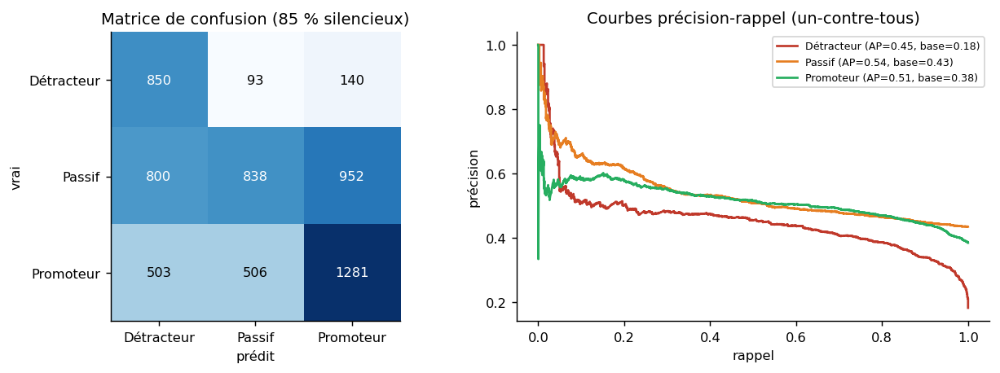
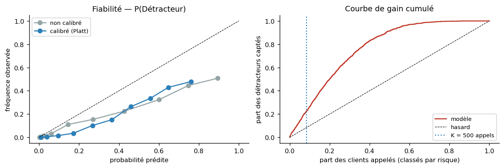
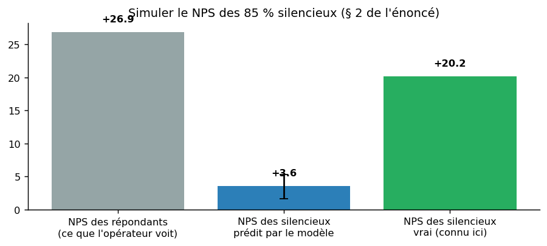
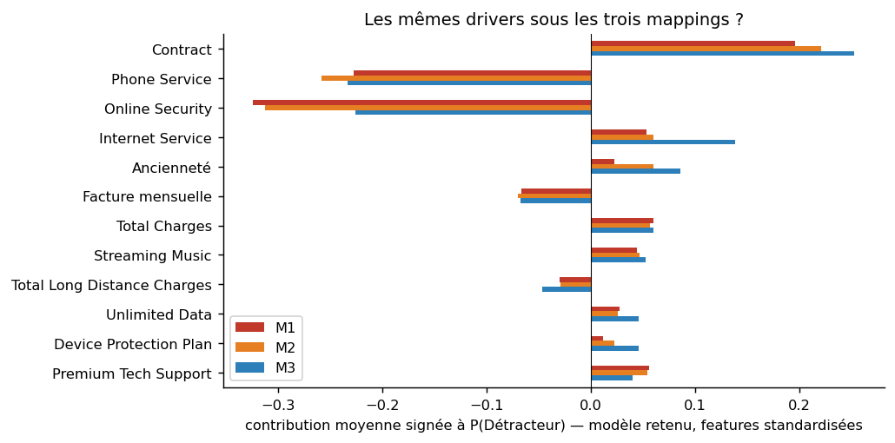
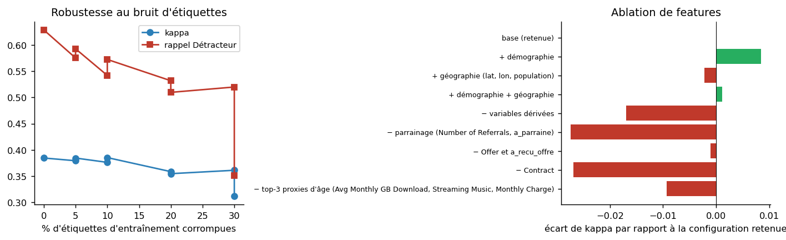
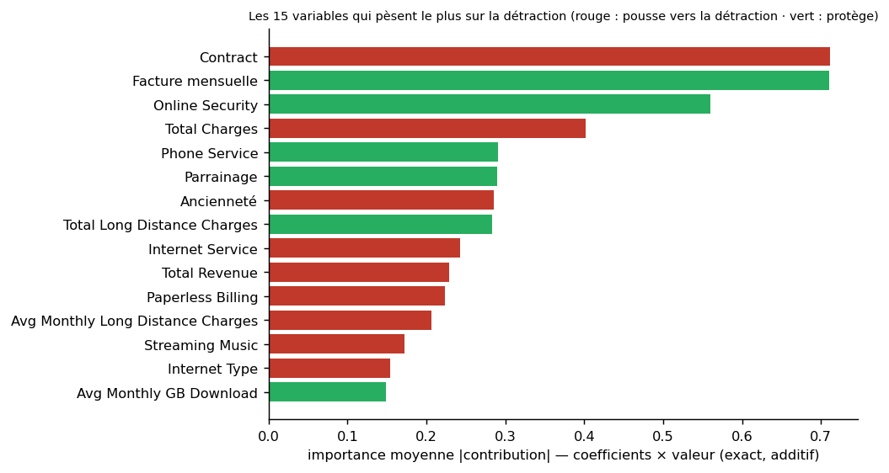
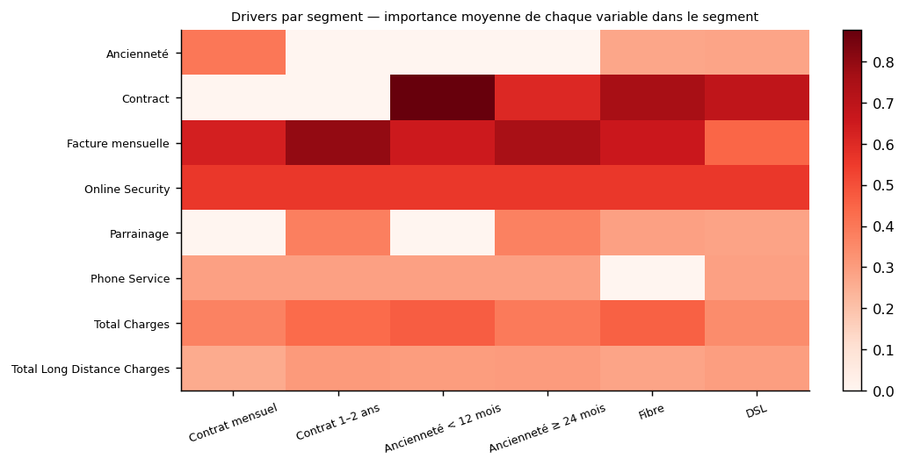
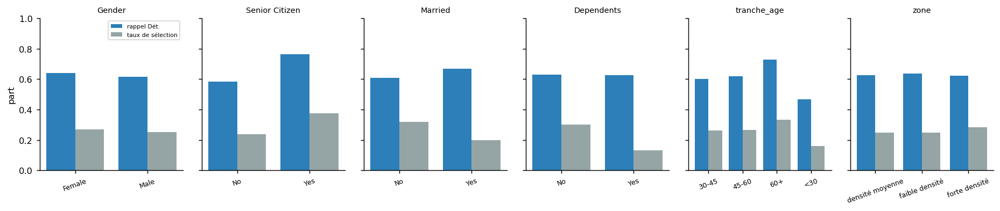
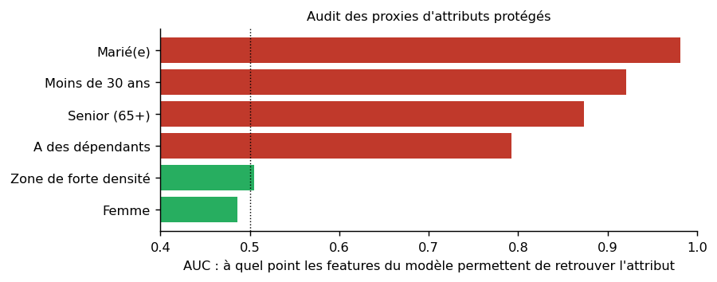

# Phase 5 — Évaluation

**En bref.** Le modèle retenu (logistique ordinale, réglée) atteint un kappa quadratique de **0.384** sur les
5963 clients silencieux, rappelle **63%** des détracteurs et garde les trois classes vivantes. Sur
500 appels, **51%** touchent un vrai détracteur contre 18% au hasard (lift ×2.8) — 18 585 € de gain net
par campagne à hypothèses constantes. Le NPS des silencieux est estimé à **+4** (IC 95 % +2 à +5) pour une vérité de
+20. Les drivers sont contractuels (engagement, ancienneté, parrainage, prix) et stables quel que soit
le mapping. Le modèle rappelle moins bien les jeunes détracteurs (47% vs 73% pour les 60+) alors qu'il
n'a aucune variable d'âge : les features retenues **reconstruisent** l'âge (AUC 0.92). Une mitigation par
seuils est chiffrée ; l'arbitrage est remonté au métier.

## 1. Évaluation technique — jamais une métrique globale sans son détail par classe

**Pourquoi ces métriques.**

| Métrique | Rôle | Pourquoi elle est là |
|---|---|---|
| Kappa quadratique pondéré | métrique principale de sélection | cible ordonnée : une erreur de deux crans (Promoteur prédit Détracteur) doit coûter plus qu'une erreur d'un cran ; le kappa quadratique le fait, l'exactitude et le F1 ne le font pas ; corrigé du hasard |
| Macro-F1 | départage | moyenne non pondérée des F1 des trois classes : une classe minoritaire abandonnée fait chuter le score, ce que l'exactitude masque |
| Exactitude équilibrée | lecture | moyenne des rappels par classe ; même logique que le macro-F1 côté rappel |
| Rappel / précision / F1 par classe | obligatoire à chaque publication | la règle du projet : le Détracteur est la classe qui compte pour le métier, le Passif celle qu'un modèle abandonne en premier |
| AUC un-contre-tous et AP (Détracteur) | qualité du classement | l'application classe les clients par P(Détracteur) : l'AUC et l'aire précision-rappel mesurent ce classement indépendamment du seuil ; l'AP est préférée sous déséquilibre |
| Brier et ECE (Détracteur) | qualité des probabilités | les probabilités servent à allouer un budget d'appels : Brier mesure leur erreur quadratique, l'ECE l'écart entre probabilité annoncée et fréquence observée |
| Précision@K, rappel@K, lift | métrique métier | la question de l'équipe rétention : « sur les K clients qu'on peut appeler ce mois-ci, combien sont réellement des détracteurs ? » |
| Exactitude brute | rapportée pour montrer qu'elle trompe | prédire toujours Passif donne ~0,43 ; l'énoncé la disqualifie comme critère |

**Résultat sur les 5963 silencieux** (modèle entraîné sur 1080 répondants, S3, cible M3) :

| Métrique globale | Valeur |
|---|---|
| Kappa quadratique pondéré | **0.384** |
| Macro-F1 | 0.490 |
| Exactitude équilibrée | 0.511 |
| AUC un-contre-tous (macro) · AUC Détracteur · AP Détracteur | 0.677 · 0.820 · 0.462 |
| Exactitude brute | 0.486 — *rapportée pour montrer qu'elle trompe : 0,43 en prédisant toujours « Passif »* |

| Classe | Précision | Rappel | F1 | Effectif |
|---|---|---|---|---|
| Détracteur | 0.438 | 0.629 | 0.516 | 1083 |
| Passif | 0.473 | 0.481 | 0.477 | 2590 |
| Promoteur | 0.547 | 0.423 | 0.477 | 2290 |

- **Le Détracteur est rappelé à 63%** — c'est la classe qui compte pour le métier. Sa précision
  est de 44% : le modèle appelle large. C'est le bon arbitrage pour une campagne de rétention où
  manquer un détracteur coûte plus qu'un appel inutile ; la précision@K en tient compte.
- **Le Passif est la classe la plus difficile** (rappel 48%) : milieu ambigu par définition, rare à
  l'entraînement (phase 3 § 4). Cohérent avec Elero et al. (2026), où la classe neutre est aussi la moins bien prédite.
- La courbe précision-rappel est plus informative que la ROC sous déséquilibre : le Détracteur a une AP de
  0.46 pour un taux de base de 0.18.
- Référence : la baseline logistique fait 0.370 de kappa sur les mêmes silencieux (le modèle retenu est au-dessus).

## 2. Calibration : ce que la courbe de fiabilité révèle

Les deux courbes sont **sous la diagonale** : le modèle surestime P(Détracteur), calibré ou non (ECE
0.15 après Platt). Cause : le calibrateur est ajusté sur les répondants, où les détracteurs sont
sur-représentés par le biais MNAR ; il apprend le taux de base des répondants, pas celui de la
population silencieuse. **La calibration sur un échantillon biaisé calibre vers la mauvaise
population** — le problème MNAR réapparaît à un autre étage. Conséquence : le **classement** des clients
par P(Détracteur) reste valide (l'ordre est préservé, AUC 0.82), mais la **valeur absolue** ne doit pas
être lue comme une fréquence — l'application l'affiche. Correction possible en production : recalibrer
sur les premières vraies réponses de la population cible (phase 6 § 4).

## 3. Évaluation métier

La vraie question n'est pas « quel taux de bonnes réponses » mais **« sur les K clients que l'équipe
peut appeler ce mois-ci, combien sont réellement des détracteurs ? »**

| K appels | Précision@K | Rappel@K | Lift | Détracteurs captés |
|---|---|---|---|---|
| 100 | 59.0% | 5.5% | ×3.25 | 59 |
| 250 | 54.8% | 12.7% | ×3.02 | 137 |
| 500 | 51.2% | 23.6% | ×2.82 | 256 |
| 750 | 50.0% | 34.6% | ×2.75 | 375 |
| 1000 | 48.0% | 44.3% | ×2.64 | 480 |
| 1500 | 43.9% | 60.9% | ×2.42 | 659 |
| 2000 | 40.6% | 74.9% | ×2.23 | 811 |

Taux de base (part de détracteurs parmi les silencieux) : **18.2%**. À K = 500, **51.2% des clients appelés sont
de vrais détracteurs — 2.8× mieux qu'au hasard.**

**Traduction en euros.** Hypothèses (paramètres dans `config.yaml`, **à valider avec l'équipe rétention**) :
coût d'un appel 12 €, valeur d'un client retenu 450 €, taux de succès 25%.

| | Campagne ciblée par le modèle | Campagne aléatoire de même taille |
|---|---|---|
| Coût | 6 000 € | 6 000 € |
| Clients retenus (estimés) | 64.0 | — |
| Gain net | **22 800 €** | 4 215 € |
| ROI | 3.80 | — |

**Apporté par le modèle : 18 585 € par campagne de 500 appels**, à hypothèses constantes.

**`CLTV` en couche de décision.** Interdite comme feature (sortie de modèle IBM : elle fuit), `CLTV` est
légitime pour pondérer *qui appeler* parmi les détracteurs prédits : c'est un choix métier, pas une
information sur la cible. Gómez-Vargas et al. (EJOR 2025) montrent qu'une CLV individuelle bat une CLV
moyenne pour cibler une campagne. L'application propose cette pondération en option.

## 4. Simuler le NPS des 85 % silencieux

| | NPS |
|---|---|
| Répondants — ce que l'opérateur observe | +26.9 |
| Silencieux — prédit par le modèle (IC 95 % bootstrap) | **+3.6** [+1.6 ; +5.3] |
| Silencieux — vrai (connu ici seulement) | +20.2 |
| Base complète — prédit | +4.2 |

| Classe | Prédit (silencieux) | Vrai (silencieux) |
|---|---|---|
| Détracteur | 26.1% | 18.2% |
| Passif | 44.2% | 43.4% |
| Promoteur | 29.7% | 38.4% |

Lecture : le modèle sous-estime le NPS des silencieux de 16.6 pts (écart marqué, la vérité est hors de l'intervalle bootstrap : celui-ci ne couvre que l'aléa d'échantillonnage, pas le biais du modèle). Composition par classe : trop de Détracteurs ; trop peu de Promoteurs ; la part de Passifs est juste. Ce sont les conséquences du biais de réponse — le modèle apprend sur des répondants polarisés et une pondération de classes qui rééquilibre le Passif — et le NPS, différence de deux parts, cumule les erreurs sur les Détracteurs et les Promoteurs. À rapporter avec l'intervalle et cette réserve ; la correction passe par les premières vraies réponses de la population cible (phase 6 § 4). **Par segment** (silencieux) :

| Segment | Clients | NPS prédit | NPS vrai | Part Dét. prédite | Part Dét. vraie |
|---|---|---|---|---|---|
| Contrat mensuel | 3087 | -40.9 | -1.3 | 49.0% | 32.1% |
| Contrat 1–2 ans | 2876 | 51.5 | 43.4 | 1.5% | 3.2% |
| Ancienneté < 12 mois | 1815 | -36.1 | -2.6 | 49.5% | 33.8% |
| Ancienneté ≥ 24 mois | 3266 | 28.1 | 32.7 | 11.3% | 9.1% |
| Fibre | 2510 | -31.4 | 2.0 | 42.7% | 27.8% |
| DSL | 1454 | 4.7 | 26.1 | 18.4% | 13.3% |
| Sans internet | 1278 | 80.8 | 50.9 | 0.0% | 4.5% |

Le classement des segments par NPS est respecté (contrats mensuels et clients récents sont bien les
plus critiques) ; les niveaux sont déformés — effet du biais de réponse.

**Peut-on corriger l'estimateur ?** Estimer la composition d'une population à partir d'un classifieur est un problème connu
— la *quantification* (Forman 2005 ; González et al. 2017). Quatre estimateurs ont été testés, avec la matrice de confusion
que le praticien peut estimer — par validation croisée sur les répondants :

| Estimateur | Détracteurs | Passifs | Promoteurs | NPS | Écart à la vérité |
|---|---|---|---|---|---|
| CC — Classify & Count — parts des classes prédites (estimateur retenu, affiché) | 26.1% | 44.2% | 29.7% | +3.6 [+2 ; +5] | -16.6 |
| PCC — Probabilistic CC — moyenne des probabilités | 31.2% | 32.4% | 36.4% | +5.1 | -15.1 |
| ACC — Adjusted CC — inversion de la matrice de confusion (CV répondants) | 19.3% | 64.1% | 16.6% | -2.7 [-9 ; +3] | -22.9 |
| PACC — Probabilistic ACC — idem avec les probabilités moyennes | 27.0% | 34.0% | 39.1% | +12.1 | -8.1 |
| **Vérité** (connue ici) | 18.2% | 43.4% | 38.4% | +20.2 | — |

Le plus proche est PACC (-8.1 pts) ; **aucun ne retrouve la vérité**. La raison est structurelle : les
corrections ACC et PACC supposent que la matrice de confusion P(prédit | vrai) est la même chez les répondants et chez les
silencieux (décalage d'a priori pur). Sous MNAR, ce n'est pas le cas — dans une même classe, les répondants sont plus
« extrêmes » que les silencieux, donc mieux classés. Une correction statistique à partir des seuls répondants ne peut pas
compenser ce biais : c'est l'argument le plus précis en faveur de vraies réponses tirées de la population cible (phase 6 § 4).

## 5. Robustesse et sensibilité

**5.1 Sensibilité au mapping de la cible** (énoncé § 4.1). Kappa du modèle retenu sous les trois
mappings (S3) : M1 0.247 · M2 0.351 · M3 0.376. ⚠️ **Ces trois nombres ne sont pas comparables** :
déplacer le milieu ambigu change la difficulté de la tâche et la prévalence des classes. Les mettre
côte à côte pour désigner un gagnant serait une erreur de lecture — il faut donc comparer autre
chose, et deux choses seulement se comparent.

**(a) Le sens des effets.** Le modèle **retenu** est réajusté sous chaque mapping sur les mêmes
répondants, et l'on regarde si une variable qui pousse vers la détraction sous M3 y pousse encore
sous M1 et M2. Sur les **12 variables les plus influentes**, **12 conservent le même sens d'effet** sous les trois mappings. Aucune ne change de signe : la lecture métier — engagement, ancienneté, parrainage, prix — ne dépend pas du mapping choisi. C'est l'amplitude qui varie, pas la direction, et c'est la seule stabilité qu'on pouvait espérer démontrer ici.

| Variable | M1 | M2 | M3 |
|---|---|---|---|
| Contract | +0.196 | +0.221 | +0.253 |
| Phone Service | -0.228 | -0.259 | -0.233 |
| Online Security | -0.324 | -0.313 | -0.226 |
| Internet Service | +0.053 | +0.060 | +0.138 |
| Ancienneté | +0.023 | +0.060 | +0.086 |
| Facture mensuelle | -0.066 | -0.070 | -0.068 |
| Total Charges | +0.060 | +0.056 | +0.060 |
| Streaming Music | +0.044 | +0.047 | +0.052 |
| Total Long Distance Charges | -0.030 | -0.029 | -0.046 |
| Unlimited Data | +0.028 | +0.026 | +0.046 |
| Device Protection Plan | +0.012 | +0.022 | +0.046 |
| Premium Tech Support | +0.056 | +0.054 | +0.040 |

**(b) L'effet métier.** C'est ce qui change vraiment pour l'équipe rétention : la part de clients
prédits détracteurs, et la qualité de la liste d'appels.

| Mapping | Taux de détracteurs réel | Détracteurs prédits | Précision@500 | Lift |
|---|---|---|---|---|
| M1 | 61.6% | 29.3% | 82.2% | ×1.33 |
| M2 | 18.2% | 27.6% | 46.0% | ×2.53 |
| M3 | 18.2% | 26.1% | 51.0% | ×2.81 |

Le mapping ne change pas seulement un score : il change la **taille du problème**. Sous M1, 62% de la base est détractrice contre 18% sous M3. La précision@500 paraît donc bien plus élevée sous M1 (82%) que sous M3 (51%) — mais c'est un mirage : le **lift**, qui rapporte la précision au taux de base, dit l'inverse (×1.33 contre ×2.81). Sous M1, viser les détracteurs n'apporte presque rien puisqu'ils sont déjà majoritaires ; c'est une raison métier supplémentaire de ne pas retenir ce mapping, indépendante de toute considération de score.

**5.2 Bruit d'étiquettes** (énoncé § 4.1 : « adding realistic noise »). On corrompt une part des
étiquettes d'entraînement et on mesure sur les silencieux, dont les étiquettes restent vraies.

Le mot important de la consigne est **realistic**, et il commande la forme du bruit. Une note
d'enquête ne se trompe pas au hasard : un promoteur mal mesuré devient passif bien plus souvent que
détracteur, et ce sont les notes du milieu qui sont les plus fragiles. Le bruit **ordinal** appliqué
ici bascule donc vers une classe adjacente dans 80 % des cas et vers la classe opposée dans 20 %, en
exposant trois fois plus les clients notés 3. Le bruit **uniforme** — toutes les erreurs
équiprobables, promoteur → détracteur compris — est rapporté à côté comme borne pessimiste, et non
comme scénario crédible.

| Bruit | Forme | Étiquettes modifiées | Kappa | Macro-F1 | Rappel Dét. | Rappel Passif | Rappel Prom. |
|---|---|---|---|---|---|---|---|
| 0% | ordinal | 0 | 0.384 | 0.490 | 0.629 | 0.481 | 0.423 |
| 5% | ordinal | 57 | 0.379 | 0.484 | 0.575 | 0.518 | 0.396 |
| 5% | uniforme | 67 | 0.384 | 0.485 | 0.593 | 0.520 | 0.388 |
| 10% | ordinal | 112 | 0.376 | 0.479 | 0.542 | 0.523 | 0.398 |
| 10% | uniforme | 120 | 0.385 | 0.487 | 0.573 | 0.558 | 0.363 |
| 20% | ordinal | 220 | 0.358 | 0.468 | 0.532 | 0.548 | 0.355 |
| 20% | uniforme | 245 | 0.354 | 0.467 | 0.510 | 0.609 | 0.307 |
| 30% | ordinal | 306 | 0.361 | 0.475 | 0.520 | 0.575 | 0.352 |
| 30% | uniforme | 362 | 0.311 | 0.436 | 0.351 | 0.693 | 0.271 |

À 30% d'étiquettes corrompues, le kappa passe de 0.384 à **0.361** sous bruit ordinal (−0.023) et à 0.311 sous bruit uniforme (−0.073). La dégradation est graduelle : le modèle ne s'effondre pas quand la cible est bruitée, ce qui importe d'autant plus que le label construit ici est probablement plus propre qu'une vraie enquête (phase 3 § 1.6). L'écart entre les deux formes (0.049) mesure ce que coûterait un bruit non ordinal — un scénario improbable, gardé comme borne basse.

**5.3 Ablation de features** — ce que chaque bloc coûte ou rapporte, modèle retenu, S3/M3, silencieux :

| Configuration | Variables | Kappa | Macro-F1 | Rappel Dét. | Rappel Passif | AUC Dét. | Δ kappa |
|---|---|---|---|---|---|---|---|
| base (retenue) | 35 | 0.384 | 0.490 | 0.629 | 0.481 | 0.818 | +0.000 |
| + démographie | 42 | 0.393 | 0.491 | 0.642 | 0.471 | 0.825 | +0.009 |
| + géographie (lat, lon, population) | 38 | 0.382 | 0.490 | 0.621 | 0.479 | 0.818 | -0.002 |
| + démographie + géographie | 45 | 0.386 | 0.490 | 0.639 | 0.471 | 0.825 | +0.001 |
| − variables dérivées | 26 | 0.367 | 0.481 | 0.608 | 0.481 | 0.806 | -0.017 |
| − parrainage (Number of Referrals, a_parraine) | 33 | 0.357 | 0.481 | 0.597 | 0.501 | 0.796 | -0.027 |
| − Offer et a_recu_offre | 33 | 0.383 | 0.488 | 0.629 | 0.478 | 0.819 | -0.001 |
| − Contract | 34 | 0.357 | 0.481 | 0.560 | 0.501 | 0.796 | -0.027 |
| − top-3 proxies d'âge (Avg Monthly GB Download, Streaming Music, Monthly Charge) | 32 | 0.375 | 0.484 | 0.609 | 0.488 | 0.817 | -0.009 |

Trois lectures. **Démographie et géographie** : ajouter la démographie change le kappa de +0.009,
la géographie de -0.002, les deux de +0.001 — c'est le **coût mesuré du choix d'équité**
(énoncé § 4.7 : « Removing a feature often costs accuracy. Make the trade-off explicit »). Il est
assumé : un gain de cet ordre ne justifie pas de décider sur l'âge, le genre ou le code postal, et
§ 7 montre que le modèle retrouve de toute façon ces attributs par proxies. **Parrainage** : retirer
`Number of Referrals` et `a_parraine` change le kappa de -0.027 — c'est le driver le plus proche de la cible sans
être une fuite (comportement passé observable). **Variables dérivées** : -0.017 — elles portent une part réelle du signal.
Retirer `Contract` : -0.027 ; retirer `Offer` : -0.001.

## 6. Drivers de détraction

**Méthode** : coefficients × valeur (exact, additif) — la même que dans l'application, client par client. **Agrégation** :
contributions sommées par variable d'origine (modalités one-hot regroupées ; blocs parrainage, ancienneté, facture mensuelle). **Périmètre** : 5963 clients silencieux ; segments d'ancienneté « < 12 mois » et « ≥ 24 mois » (la bande 12–24 mois est volontairement écartée pour contraster) ; accès « Fibre » et « DSL » (câble et sans internet non représentés).

Un mot sur l'agrégation, parce qu'elle change la lecture du tableau. L'encodage one-hot crée une
colonne par modalité et le modèle répartit l'effet entre elles ; lire `Online Security = No` et
`Online Security = Yes` comme deux variables de signes opposés n'a aucun sens, ce sont les deux faces
d'une seule. Les colonnes d'une même variable d'origine sont donc **sommées avant tout classement**,
et les blocs métier redondants sont regroupés — le parrainage réunit `Number of Referrals` et
`a_parraine`, dont les coefficients se compensaient et faisaient apparaître « avoir parrainé » comme
un facteur de risque. Après agrégation, l'effet net du parrainage est protecteur, conformément au
texte de cette section.

| Variable | Importance | Sens de l'effet | Nature |
|---|---|---|---|
| Contract | 0.7112 | ▲ « Month-to-Month » pousse vers la détraction | catégorielle |
| Facture mensuelle | 0.7110 | ▲ une valeur élevée pousse vers la détraction | numérique |
| Online Security | 0.5603 | ▲ « Yes » pousse vers la détraction | catégorielle |
| Total Charges | 0.4013 | ▼ une valeur élevée protège | numérique |
| Phone Service | 0.2903 | ▲ « No » pousse vers la détraction | catégorielle |
| Parrainage | 0.2893 | ▼ une valeur élevée protège | numérique |
| Ancienneté | 0.2856 | ▲ « 0-6m » pousse vers la détraction | catégorielle |
| Total Long Distance Charges | 0.2833 | ▲ une valeur élevée pousse vers la détraction | numérique |
| Internet Service | 0.2423 | ▲ « Yes » pousse vers la détraction | catégorielle |
| Total Revenue | 0.2284 | ▼ une valeur élevée protège | numérique |
| Paperless Billing | 0.2230 | ▲ « Yes » pousse vers la détraction | catégorielle |
| Avg Monthly Long Distance Charges | 0.2061 | ▼ une valeur élevée protège | numérique |
| Streaming Music | 0.1722 | ▲ « No » pousse vers la détraction | catégorielle |
| Internet Type | 0.1544 | ▲ « Cable » pousse vers la détraction | catégorielle |
| Avg Monthly GB Download | 0.1485 | ▼ une valeur élevée protège | numérique |
| Device Protection Plan | 0.1432 | ▲ « No » pousse vers la détraction | catégorielle |
| Unlimited Data | 0.1330 | ▲ « Yes » pousse vers la détraction | catégorielle |
| Payment Method | 0.1235 | ▲ « Bank Withdrawal » pousse vers la détraction | catégorielle |
| Online Backup | 0.1171 | ▲ « No » pousse vers la détraction | catégorielle |
| Streaming Movies | 0.0983 | ▲ « Yes » pousse vers la détraction | catégorielle |

*Lecture du sens* : ▲ = pousse vers la détraction, ▼ = protège. Pour une variable numérique, le sens est celui de l'effet d'une valeur élevée ; pour une variable catégorielle, la modalité en cause est nommée, car « Contract » ne pousse ni ne protège en soi — c'est « Month-to-Month » qui pousse. ⚠️ La colonne « contribution moyenne » ne donne PAS le sens : pour une variable numérique standardisée elle vaut environ zéro par construction.

**Ce que dit le modèle, et ce que disent les données.** Un coefficient et une statistique
descriptive ne répondent pas à la même question. Les confronter est le seul moyen de savoir quand
on peut lire un driver comme un conseil d'action.

| Variable | Effet dans le modèle (toutes choses égales) | Association brute observée |  |
|---|---|---|---|
| Contract | ▲ « Month-to-Month » pousse vers la détraction | 32.1% de détracteurs pour « Month-to-Month » contre 1.2% pour « Two Year » | ✅ concordent |
| Facture mensuelle | ▲ une valeur élevée pousse vers la détraction | 22.2% de détracteurs dans le quart le plus élevé de `Monthly Charge` contre 7.5% dans le quart le plus bas | ✅ concordent |
| Online Security | ▲ « Yes » pousse vers la détraction | 21.3% de détracteurs pour « No » contre 10.7% pour « Yes » | ⚠️ divergent |
| Total Charges | ▼ une valeur élevée protège | 9.3% de détracteurs dans le quart le plus élevé de `Total Charges` contre 30.9% dans le quart le plus bas | ✅ concordent |
| Phone Service | ▲ « No » pousse vers la détraction | écart brut négligeable entre modalités (18.2% contre 17.7%) | — rien à conclure |
| Parrainage | ▼ une valeur élevée protège | 3.7% de détracteurs dans le quart le plus élevé de `Number of Referrals` contre 22.1% dans le quart le plus bas | ✅ concordent |
| Ancienneté | ▲ « 0-6m » pousse vers la détraction | 36.9% de détracteurs pour « 0-6m » contre 5.7% pour « 4a+ » | ✅ concordent |
| Total Long Distance Charges | ▲ une valeur élevée pousse vers la détraction | 8.0% de détracteurs dans le quart le plus élevé de `Total Long Distance Charges` contre 29.1% dans le quart le plus bas | ⚠️ divergent |
| Internet Service | ▲ « Yes » pousse vers la détraction | 21.9% de détracteurs pour « Yes » contre 4.5% pour « No » | ✅ concordent |
| Total Revenue | ▼ une valeur élevée protège | 9.5% de détracteurs dans le quart le plus élevé de `Total Revenue` contre 31.9% dans le quart le plus bas | ✅ concordent |

⚠️ **Sur 2 variable(s), l'effet du modèle et l'association brute pointent en sens contraires.** Ce n'est pas une anomalie à corriger, c'est une distinction à comprendre, et la signaler vaut mieux que de laisser le lecteur la découvrir seul.

- **Online Security** — le modèle dit « ▲ « Yes » pousse vers la détraction », les données disent 21.3% de détracteurs pour « No » contre 10.7% pour « Yes ».
- **Total Long Distance Charges** — le modèle dit « ▲ une valeur élevée pousse vers la détraction », les données disent 8.0% de détracteurs dans le quart le plus élevé de `Total Long Distance Charges` contre 29.1% dans le quart le plus bas.

**Comment les deux peuvent être vrais.** Le coefficient est un effet *toutes choses égales par ailleurs* : il répond à « entre deux clients qui ont le même contrat, la même ancienneté, la même facture et le même nombre de services, lequel est le plus à risque ? ». L'association brute répond à une autre question : « dans la base telle qu'elle est, qui est le plus à risque ? ». Souscrire une option augmente aussi la facture et le nombre de services, qui sont dans le modèle ; une fois ces effets tenus constants, il ne reste du signal de l'option que ce qu'elle apporte en plus, et ce résidu peut changer de signe.

**Ce qu'il faut en faire, côté métier.** Pour **cibler**, c'est le modèle qui décide : il classe des clients réels avec toutes leurs caractéristiques à la fois. Pour **agir**, c'est l'association brute qui doit primer tant qu'aucune expérience n'a tranché : recommander de retirer une option parce que son coefficient est positif serait une faute, puisque les clients qui l'ont sont, dans les faits, deux fois moins détracteurs. C'est la raison de fond du groupe de contrôle demandé en phase 6 § 5.

*(Deux rédactions antérieures étaient fautives et il vaut mieux le dire que de laisser croire que ce
tableau a toujours eu cette forme. La première affichait une « corrélation entre la valeur et la
contribution » : pour un modèle additif elle vaut ±1 par construction et ne mesurait rien. La seconde
affichait la contribution moyenne signée : pour une variable numérique standardisée, cette moyenne
vaut environ zéro, et elle faisait apparaître la facture mensuelle comme protectrice — le contraire
de ce que dit le modèle. Le sens est désormais calculé selon la nature de la variable.)*

**Ce que le modèle dit.** Les associations sont fortes et cohérentes avec la littérature sur ce
dataset (Chong et al. 2023) et sur le NPS télécom (Elero et al. 2026) : **contrat sans engagement,
faible ancienneté, absence de parrainage, charge mensuelle élevée** vont avec la détraction ; l'offre E
ressort comme marqueur de clients déjà fragiles (phase 2 § 5.5), pas comme cause. **Le modèle établit
des associations, pas des causes** : un coefficient positif est un signal, pas un levier prouvé.

**Drivers par segment** (énoncé § 4.6) — où chaque variable pèse le plus :

⚠️ **Ce tableau ne dit pas ce qu'on croit qu'il dit, et la nuance est importante.** Le modèle retenu
est additif, sans terme d'interaction : le coefficient d'une variable est **le même dans tous les
segments**. Ce qui change d'un segment à l'autre, c'est la *distribution des valeurs*, donc le poids
que la variable prend dans le total. Un « driver de segment » est donc un **effet de composition**,
pas un effet propre au segment, et l'affirmer autrement serait faux. La variable qui définit un
segment est par ailleurs exclue de son propre classement : dire que « contrat mensuel » est le
premier driver du segment « contrat mensuel » ne renseigne personne, puisqu'elle y vaut 1 partout.
Pour obtenir de vrais drivers propres à chaque segment, il faudrait ajuster un modèle par segment ou
introduire des interactions — c'est hors du périmètre retenu (phase 1 § 5.2).

| Segment | Clients | Driver 1 | Driver 2 | Driver 3 | Driver 4 | Driver 5 |
|---|---|---|---|---|---|---|
| Contrat mensuel | 3087 | Facture mensuelle (0.63) | Online Security (0.56) | Ancienneté (0.40) | Total Charges (0.37) | Phone Service (0.29) |
| Contrat 1–2 ans | 2876 | Facture mensuelle (0.80) | Online Security (0.56) | Total Charges (0.43) | Parrainage (0.38) | Total Long Distance Charges (0.31) |
| Ancienneté < 12 mois | 1815 | Contract (0.88) | Facture mensuelle (0.65) | Online Security (0.56) | Total Charges (0.47) | Total Long Distance Charges (0.30) |
| Ancienneté ≥ 24 mois | 3266 | Facture mensuelle (0.75) | Contract (0.60) | Online Security (0.56) | Total Charges (0.39) | Parrainage (0.38) |
| Fibre | 2510 | Contract (0.76) | Facture mensuelle (0.66) | Online Security (0.56) | Total Charges (0.46) | Parrainage (0.29) |
| DSL | 1454 | Contract (0.69) | Online Security (0.56) | Facture mensuelle (0.45) | Total Charges (0.35) | Total Long Distance Charges (0.30) |

*Chaque cellule donne la variable et son **poids** dans le segment. Aucun sens n'y figure, et c'est
volontaire : le modèle étant additif, le sens d'une variable est le même dans tous les segments — il
se lit dans le tableau global ci-dessus. Ce qui change ici, c'est uniquement l'importance relative.*

**Ce qu'on y lit.** chez **ancienneté ≥ 24 mois** (3266 clients), la variable qui pèse le plus est **Facture mensuelle** (poids 0.75) ; chez **ancienneté < 12 mois** (1815 clients), la variable qui pèse le plus est **Contract** (poids 0.88) ; chez **fibre** (2510 clients), la variable qui pèse le plus est **Contract** (poids 0.76) ; chez **dsl** (1454 clients), la variable qui pèse le plus est **Contract** (poids 0.69) ; chez **contrat mensuel** (3087 clients), la variable qui pèse le plus est **Facture mensuelle** (poids 0.63) ; chez **contrat 1–2 ans** (2876 clients), la variable qui pèse le plus est **Facture mensuelle** (poids 0.80). Ces différences sont des effets de composition : le même coefficient appliqué à des populations dont les valeurs diffèrent. Elles restent utiles au ciblage — elles disent sur quoi insister dans quel segment — mais elles ne prouvent pas qu'une variable agit différemment ailleurs.

**Actionnable ou non, et levier** — construit à partir des **dix premiers drivers réels** du tableau
ci-dessus, pas d'une liste écrite à la main. La distinction que demande l'énoncé est celle-ci : une
entreprise peut changer un contrat, elle ne peut pas changer une démographie.

| Driver (rang) | Contribution moyenne | Actionnable ? | Levier |
|---|---|---|---|
| 1. Contract | +0.253 | **oui** | proposer un engagement 12 mois avec avantage |
| 2. Facture mensuelle | -0.068 | **oui** | revue tarifaire, bundle |
| 3. Online Security | -0.226 | **oui** | inclure la sécurité en ligne dans l'offre |
| 4. Total Charges | +0.060 | non directement | conséquence du prix et de l'ancienneté — agir sur ceux-ci |
| 5. Phone Service | -0.233 | partiellement | revoir le couplage voix / internet |
| 6. Parrainage | -0.027 | indirectement | programme de parrainage, invitation ciblée |
| 7. Ancienneté | +0.086 | partiellement | parcours d'accueil renforcé les six premiers mois |
| 8. Total Long Distance Charges | -0.046 | partiellement | forfait longue distance adapté |
| 9. Internet Service | +0.138 | à qualifier avec le métier | — |
| 10. Total Revenue | +0.038 | non directement | conséquence du prix et de l'ancienneté — agir sur ceux-ci |

À part, parce qu'il ne vient pas du modèle : **l'offre E** ressort de l'analyse exploratoire
(phase 2 § 5.5) comme marqueur de clients déjà fragiles, et non comme cause. Elle ne figure pas dans
les dix premiers drivers ; la conclusion métier est de comprendre **à qui** elle a été proposée, pas
de la supprimer.

**Règle de recommandation individuelle** (implémentée, affichée pour chaque client) :
- le levier retenu est le premier levier actionnable parmi les facteurs de risque propres au client, classés par contribution décroissante à P(Détracteur)
- Engagement → Proposer un engagement 12 mois avec avantage — déclenché par : Contract
- Prix → Revue tarifaire / bundle (charge par service élevée) — déclenché par : Facture mensuelle, Monthly Charge, charge_par_service
- Accueil → Parcours d'accueil renforcé (client récent) — déclenché par : Ancienneté, Tenure in Months, tranche_anciennete
- Support → Proposer le support technique premium ou la sécurité en ligne — déclenché par : Premium Tech Support, Online Security, Online Backup
- Parrainage → Inviter au programme de parrainage — déclenché par : Parrainage, Number of Referrals, a_parraine
- aucun levier actionnable chez ce client → Appel de courtoisie et diagnostic

Répartition parmi les détracteurs prédits :

| Levier recommandé | Détracteurs prédits concernés |
|---|---|
| Proposer un engagement 12 mois avec avantage | 1476 |
| Revue tarifaire / bundle (charge par service élevée) | 45 |
| Proposer le support technique premium ou la sécurité en ligne | 15 |
| Appel de courtoisie et diagnostic | 11 |
| Parcours d'accueil renforcé (client récent) | 9 |

**95 % des détracteurs prédits reçoivent le même premier levier.**

le premier levier est concentré parce que la base l'est : le contrat mensuel est à la fois le premier facteur de risque et la situation de la quasi-totalité des détracteurs prédits. La recommandation reste vraie, mais elle ne trie pas — c'est le SECOND levier qui différencie deux clients également mensuels, et c'est pourquoi les deux sont livrés.

Les couples (premier levier ▸ second levier) les plus fréquents :

| Premier levier ▸ second levier | Clients |
|---|---|
| Proposer un engagement 12 mois avec avantage  ▸  Parcours d'accueil renforcé (client récent) | 734 |
| Proposer un engagement 12 mois avec avantage  ▸  Revue tarifaire / bundle (charge par service élevée) | 363 |
| Proposer un engagement 12 mois avec avantage  ▸  Proposer le support technique premium ou la sécurité en ligne | 305 |
| Proposer un engagement 12 mois avec avantage  ▸  Inviter au programme de parrainage | 47 |
| Revue tarifaire / bundle (charge par service élevée)  ▸  Proposer un engagement 12 mois avec avantage | 37 |
| Proposer un engagement 12 mois avec avantage  ▸  — | 27 |
| Appel de courtoisie et diagnostic  ▸  — | 11 |
| Proposer le support technique premium ou la sécurité en ligne  ▸  — | 9 |
| Parcours d'accueil renforcé (client récent)  ▸  Revue tarifaire / bundle (charge par service élevée) | 4 |
| Revue tarifaire / bundle (charge par service élevée)  ▸  Proposer le support technique premium ou la sécurité en ligne | 4 |

Le second levier prend **6 valeurs distinctes** : c'est lui qui rend deux fiches client différentes, et c'est lui qu'il faut lire en priorité quand le premier est « engagement ».

*heuristique dérivée des drivers — donc d'associations, pas d'un effet causal mesuré. Un levier est une hypothèse à tester en campagne, avec groupe de contrôle (10 à 20 % des ciblés non appelés).*

## 7. Équité et biais (énoncé § 4.7)

Les variables démographiques et géographiques sont **exclues du modèle** et servent **uniquement ici**.
On mesure, par sous-groupe, le rappel Détracteur (le modèle rate-t-il davantage certains détracteurs ?),
la précision, et le **taux de sélection** (quelle part du groupe est prédite détracteur — c'est ce qui
alloue le budget d'appels). `zone` = tertiles de population du code postal (proxy de densité).

| Dimension | Groupe | Clients | Détracteurs réels | Taux de sélection | Rappel Dét. | Précision Dét. |
|---|---|---|---|---|---|---|
| Gender | Female | 2939 | 18.4% | 27.1% | 64.1% | 43.5% |
| Gender | Male | 3024 | 18.0% | 25.2% | 61.7% | 44.0% |
| Senior Citizen | No | 5019 | 16.3% | 23.9% | 58.5% | 39.7% |
| Senior Citizen | Yes | 944 | 28.3% | 37.6% | 76.4% | 57.5% |
| Married | No | 3110 | 22.4% | 31.9% | 60.7% | 42.7% |
| Married | Yes | 2853 | 13.5% | 19.8% | 66.8% | 45.7% |
| Dependents | No | 4568 | 22.3% | 30.0% | 62.9% | 46.7% |
| Dependents | Yes | 1395 | 4.6% | 13.2% | 62.5% | 21.7% |
| tranche_age | 30-45 | 1656 | 16.9% | 26.2% | 60.0% | 38.8% |
| tranche_age | 45-60 | 1619 | 16.7% | 26.6% | 62.0% | 39.0% |
| tranche_age | 60+ | 1503 | 24.6% | 33.4% | 72.9% | 53.6% |
| tranche_age | <30 | 1185 | 13.8% | 16.0% | 46.6% | 40.0% |
| zone | densité moyenne | 1998 | 16.1% | 25.0% | 62.6% | 40.3% |
| zone | faible densité | 1982 | 17.4% | 25.0% | 63.8% | 44.4% |
| zone | forte densité | 1983 | 21.0% | 28.3% | 62.4% | 46.3% |

| Dimension | Écart max de rappel (pts) | Écart max de sélection (pts) |
|---|---|---|
| Gender | 2.4 | 1.9 |
| Senior Citizen | 17.9 | 13.7 |
| Married | 6.2 | 12.1 |
| Dependents | 0.4 | 16.9 |
| tranche_age | 26.3 | 17.4 |
| zone | 1.4 | 3.4 |

*Tranches d'âge fermées à gauche : « <30 » = [0 ; 30[, « 60+ » = [60 ; 120[. Les bornes disent donc
exactement ce que les libellés annoncent, et le groupe « moins de 30 ans » est le même ici et dans
l'audit des proxies (§ 7.2).*

**7.1 Ce qu'on trouve.** L'écart le plus important porte sur **tranche_age : 26 points** de rappel entre le groupe le
mieux servi et le moins bien servi — le modèle rappelle 47% des détracteurs de moins de 30 ans contre
73% des 60 ans et plus. C'est exactement le cas de figure que l'énoncé décrit comme inacceptable,
**en sens inverse** : ce sont les jeunes détracteurs qu'on rate.

**Et les écarts de taux de sélection ?** Le tableau en montre de larges sur d'autres dimensions — le
taux de sélection est la part du groupe qu'on prédit détractrice, donc ce qui **alloue réellement le
budget d'appels**. Il faut les lire, et ils ne disent pas tous la même chose.

- **tranche_age** — sélection 33% pour « 60+ » contre 16% pour « <30 » (17 pts d'écart), alors que le taux de détracteurs *réel* passe de 14% à 25% (11 pts). L'écart de budget **ne s'explique pas entièrement** par l'écart de besoin : à examiner. ⚠️ Mais le rappel diffère aussi de 26 points sur cette dimension : c'est un défaut de **détection**, pas une différence de besoin — c'est le cas de l'âge, et c'est lui qu'il faut corriger.
- **Dependents** — sélection 30% pour « No » contre 13% pour « Yes » (17 pts d'écart), alors que le taux de détracteurs *réel* passe de 5% à 22% (18 pts). L'écart de budget **suit l'écart de besoin** : le modèle appelle davantage là où il y a davantage de clients mécontents, ce qui est le comportement attendu et non un biais. Le rappel, lui, est homogène sur cette dimension.
- **Senior Citizen** — sélection 38% pour « Yes » contre 24% pour « No » (14 pts d'écart), alors que le taux de détracteurs *réel* passe de 16% à 28% (12 pts). L'écart de budget **suit l'écart de besoin** : le modèle appelle davantage là où il y a davantage de clients mécontents, ce qui est le comportement attendu et non un biais. ⚠️ Mais le rappel diffère aussi de 18 points sur cette dimension : c'est un défaut de **détection**, pas une différence de besoin — c'est le cas de l'âge, et c'est lui qu'il faut corriger.

**7.2 Les features « proxent »-elles les attributs protégés ?** Pour chaque attribut exclu, on mesure à
quel point les features du modèle permettent de le reconstruire (AUC en validation croisée) :

| Attribut (exclu du modèle) | Prévalence | AUC de reconstruction | Lecture |
|---|---|---|---|
| Moins de 30 ans | 19.9% | 0.920 | fortement reconstructible |
| Senior (65+) | 15.8% | 0.874 | fortement reconstructible |
| Femme | 49.3% | 0.486 | non reconstructible |
| Marié(e) | 47.9% | 0.982 | fortement reconstructible |
| A des dépendants | 23.4% | 0.793 | fortement reconstructible |
| Zone de forte densité | 33.3% | 0.505 | non reconstructible |

**Exclure une variable ne suffit pas à ce que le modèle l'ignore.** C'est la raison structurelle de
l'écart d'âge : le modèle « voit » l'âge sans en avoir la colonne. Mais dire cela ne suffit pas non
plus — encore faut-il nommer **quelles** variables le reconstruisent, sinon le constat ne peut être
ni vérifié ni corrigé. Les voici, tirées des coefficients du classifieur de reconstruction :

| Attribut | Variable du modèle | Coefficient (standardisé) |
|---|---|---|
| Moins de 30 ans | Avg Monthly GB Download | +2.72 |
| Moins de 30 ans | Streaming Music_Yes | +1.92 |
| Moins de 30 ans | Streaming Music_No | -1.90 |
| Moins de 30 ans | Streaming Movies_No | +1.68 |
| Moins de 30 ans | Streaming Movies_Yes | -1.66 |
| Senior (65+) | Streaming Music_Yes | -2.95 |
| Senior (65+) | Streaming Music_No | +2.80 |
| Senior (65+) | Streaming Movies_No | -2.34 |
| Senior (65+) | Streaming Movies_Yes | +2.19 |
| Senior (65+) | Monthly Charge | +1.24 |
| Femme | Unlimited Data_Yes | -0.26 |
| Femme | Unlimited Data_No | +0.25 |
| Femme | Internet Type_Fiber Optic | +0.22 |
| Femme | Offer_Offer C | -0.21 |
| Femme | Internet Type_Pas d'internet | -0.20 |
| Marié(e) | a_parraine | +4.48 |
| Marié(e) | Number of Referrals | +1.35 |
| Marié(e) | Tenure in Months | +0.84 |
| Marié(e) | Unlimited Data_Yes | +0.45 |
| Marié(e) | Internet Type_Pas d'internet | +0.34 |
| A des dépendants | a_parraine | +0.81 |
| A des dépendants | Avg Monthly GB Download | +0.55 |
| A des dépendants | Unlimited Data_Yes | -0.34 |
| A des dépendants | Offer_Offer D | +0.34 |
| A des dépendants | Unlimited Data_No | +0.32 |
| Zone de forte densité | Offer_Offer C | +0.23 |
| Zone de forte densité | tranche_anciennete_6-12m | +0.22 |
| Zone de forte densité | tranche_anciennete_4a+ | -0.19 |
| Zone de forte densité | Tenure in Months | +0.17 |
| Zone de forte densité | Unlimited Data_Yes | -0.14 |

**Et si on les retirait ?** La question mérite un chiffre, pas une opinion. Une configuration d'ablation « − top-3 proxies d'âge » (Avg Monthly GB Download, Streaming Music, Monthly Charge) a été ajoutée au tableau du § 5.3 : le kappa y varie de **-0.009** pour 32 variables conservées. Le coût est faible, mais le bénéfice l'est tout autant : l'âge reste reconstructible par les variables restantes, parce qu'il l'est par la structure même de la clientèle (les jeunes sont en contrat mensuel et récents). Retirer trois variables déplacerait le problème sans le résoudre.

**Ce qu'on garde, ce qu'on retire, et pourquoi.** On **garde** ces variables. Elles ne sont pas des
substituts commodes de l'âge : ce sont les leviers du métier — le contrat, l'ancienneté, la facture,
les services. Les retirer coûterait de la performance sans faire disparaître l'information, puisque
d'autres variables corrélées prendraient le relais, et priverait la recommandation de tout contenu
actionnable. On **retire** en revanche les attributs protégés eux-mêmes (âge, genre, situation
familiale, code postal), ce qui empêche une décision *explicite* sur l'attribut. Ce choix est
défendable, il n'est pas suffisant : il appelle l'audit ci-dessus à chaque réentraînement.

⚠️ **Une limite à ne pas taire.** L'énoncé cite le code postal comme proxy du niveau
socio-économique. Ici, la seule variable géographique disponible est la **densité de population** du
code postal, et c'est elle qui est testée — pas le revenu. Aucune donnée de revenu par code postal
n'a été jointe (phase 2 § 6), donc la reconstruction d'un **niveau socio-économique** par la facture
ou les services **n'a pas pu être auditée**. Si un enrichissement Census était un jour ajouté, il
devrait l'être d'abord pour cet audit, et non pour le modèle.

**7.3 Mitigation testée : un seuil de décision par tranche d'âge**, calé pour que chaque groupe
atteigne le rappel global (63%).

**Deux précautions de méthode, sans lesquelles les chiffres seraient flatteurs.** D'abord, les seuils
sont appris **sur les répondants** puis appliqués aux silencieux. Les caler sur les silencieux
eux-mêmes — c'est-à-dire sur la population qui sert ensuite à juger la mitigation — égaliserait les
rappels *par construction* : on mesurerait l'ajustement, pas l'effet. Ensuite, le seuil retenu est le
seuil **exact**, non arrondi : comme il vaut par construction la probabilité d'un détracteur précis,
l'arrondir à quatre décimales excluait ce client de chaque groupe et faisait diverger le tableau
global du tableau par groupe.

| Politique | Écart max de rappel | Appels | Vrais détracteurs appelés | Gain net | Rappel 30-45 | Rappel 45-60 | Rappel 60+ | Rappel <30 |
|---|---|---|---|---|---|---|---|---|
| aucune (seuil unique, classe la plus probable) | 26.3% | 1556 | 681 | 57 940 € | 60.0% | 62.0% | 72.9% | 46.6% |
| nivellement — seuils appris sur les répondants, tous les groupes visent le rappel global | 16.4% | 1829 | 754 | 62 877 € | 65.7% | 77.1% | 71.0% | 60.7% |
| rattrapage — seul le groupe le moins bien servi (<30) est relevé | 12.9% | 1659 | 704 | 59 292 € | 60.0% | 62.0% | 72.9% | 60.7% |
| nivellement in-sample — seuils calés sur les silencieux (optimiste, pour comparaison) | 0.1% | 1631 | 684 | 57 378 € | 63.2% | 63.1% | 63.1% | 63.2% |

**La promesse et le réel.** Calés sur les silencieux eux-mêmes, les seuils égalisent les rappels presque parfaitement (0.1% d'écart résiduel). Appris sur les répondants et appliqués aux silencieux — la seule façon honnête de procéder — ils ramènent l'écart de 26.3% à **16.4%**, sans l'annuler. C'est l'écart entre ce qu'une mitigation promet sur le papier et ce qu'elle tient en production.

**Ce que coûte le nivellement, en euros.** Il ajoute **273 appels** par campagne, soit 3 276 € au coût d'appel retenu (12 € l'appel), pour un gain net qui passe de 57 940 € à 62 877 €. ⚠️ Et il faut dire ce que « niveler » veut dire : ramener **tous** les groupes au rappel global **abaisse** la couverture de ceux qui étaient les mieux servis. Les seniors mécontents aujourd'hui détectés le seraient moins. Égaliser par le bas est une décision, pas une correction technique.

**La variante qui ne prend rien à personne.** Ne relever que le groupe le moins bien servi (« <30 »), sans toucher aux autres seuils, ramène l'écart à **12.9%** pour **103 appels** de plus (1 236 €) et un gain net de 59 292 €. C'est la politique que cette étude recommande de soumettre au métier : elle corrige l'inégalité sans dégrader la détection d'un seul groupe.

C'est un arbitrage **métier et juridique**, pas technique.

**7.4 À remonter avant production.** L'énoncé demande de signaler ce qui doit remonter à une équipe
Expérience Client ou juridique. Trois points, formulés comme des **questions à poser**, pas comme des
conclusions que la data science n'a pas qualité à rendre.

1. **L'écart d'âge (26 points) et sa cause.** Le modèle n'utilise pas l'âge, mais le contrat,
   l'ancienneté et les services le reconstruisent (§ 7.2). *Question au métier* : une couverture
   inégale des clients mécontents selon l'âge est-elle acceptable pendant le temps qu'il faudra pour
   la corriger, et si non, quelle politique du § 7.3 retient-on ?
2. **La mitigation est possible et chiffrée, mais c'est un traitement différencié selon l'âge.**
   *Question au juridique*, et elle n'a pas la même réponse partout : un seuil par tranche d'âge
   est-il un traitement différencié prohibé ou une mesure correctrice admise ? Les cadres à
   consulter : en France et dans l'Union européenne, la prohibition des discriminations fondées sur
   l'âge dans la fourniture de biens et services (loi n° 2008-496 et article 225-1 du code pénal),
   ainsi que les obligations du règlement européen sur l'IA pour les systèmes affectant l'accès à des
   services ; aux États-Unis — le dataset est californien — il n'existe pas de protection générale de
   l'âge en marketing grand public hors crédit (ECOA), mais le Unruh Civil Rights Act s'applique en
   Californie. *(L'étude ne tranche pas ce point : elle le pose, chiffré, à qui a qualité pour le faire.)*
3. **L'audit doit être répété à chaque réentraînement.** Il l'est : le rappel Détracteur par tranche
   d'âge est recalculé sur les réponses cumulées de chaque mois et lève une alerte au-delà du seuil
   de signalement (phase 6 § 4). Le seuil est celui de la phase 1 — 10% — et le même partout dans
   l'étude ; une version antérieure de la carte de monitoring en annonçait 15, incohérence corrigée.

## 8. Limites de la règle de ciblage

Cette étude classe les clients par **risque** d'être détracteur, comme demandé. Or Ascarza (2018,
*Journal of Marketing Research*) établit, par deux expériences de terrain, que cibler les clients au
risque le plus élevé est inefficace : il faut cibler ceux dont la **sensibilité à l'intervention** est
la plus forte — même campagne, même budget, jusqu'à 7 points de churn en moins.

| | On l'appelle | On ne l'appelle pas | |
|---|---|---|---|
| | reste | reste | **acquis** — appel gaspillé |
| | part | part | **perdu d'avance** — appel gaspillé |
| | **reste** | **part** | **persuadable** — seul cas qui crée de la valeur |
| | part | reste | **à ne pas déranger** — l'appel nuit |

Les détracteurs les plus certains sont massivement des *perdus d'avance*. **On ne peut pas estimer
cette sensibilité ici** : aucune campagne enregistrée, aucune assignation aléatoire (la table `Offer`
prouve que les offres ont été ciblées). Prétendre faire de l'uplift serait la faute reprochée à Mustafa
et al. La seule chose à faire, gratuite, est en phase 6 § 5.

## 9. Revue du processus

| Critère de succès (phase 1) | Résultat | Verdict |
|---|---|---|
| Précision@500 ≥ 35% et lift ≥ 2 | 51.2% vs 18.2% de base (×2.8) | ✅ |
| Gain net vs aléatoire, en euros | 18 585 € par campagne | ✅ (hypothèses à valider) |
| Kappa au niveau de la baseline ou au-dessus | retenu logistique ordinale : 0.384 ; baseline logistique : 0.370 | ✅ |
| Rappel Détracteur au niveau de la baseline ou au-dessus | retenu 0.629 ; baseline 0.785 | ⚠️ **non atteint** — voir la note sous le tableau |
| Aucune classe abandonnée | rappel Passif 0.48 | ✅ |
| Écart d'équité mesuré, signalé si > 10 pts | 26 pts sur l'âge, cause identifiée, mitigation chiffrée | ⚠️ **signalé, arbitrage remonté** |

⚠️ **Le critère de rappel Détracteur n'est pas atteint, et ce n'est pas un oubli.** La baseline logistique capte 78% des détracteurs contre 63% pour le modèle retenu. Elle y parvient en prédisant « Détracteur » beaucoup plus souvent : sa précision est plus faible et elle écrase la classe Passif. Le critère qui décide de l'usage réel est la précision à capacité d'appel fixe, et il départage dans l'autre sens — 51% pour le modèle retenu contre 54% pour la baseline. Un rappel élevé obtenu en sur-prédisant une classe n'est pas une performance : on publie le chiffre défavorable, et la raison de ne pas le suivre.

**Solide** : registre de fuites quantifié ; arbitrage empirique des « 3 » sans circularité ; protocole
15/85 avec coût du MNAR mesuré ; quinze modèles, sélection sans regarder le test ; calibration
vérifiée ; audit d'équité avec proxies et mitigation. **Approximatif** : hypothèses économiques
(placeholders) ; propension à répondre simulée ; verbatims synthétiques sans clé API ; TabPFN 2.5 non
évalué, faute d'acceptation de licence PriorLabs. **Impossible avec ces données** : estimer l'effet
d'un appel, et distinguer une note d'enquête d'une note construite en cohérence avec le churn
(phase 3 § 1.6).

**Reproductibilité — test à blanc depuis une copie vierge.** Protocole : copie de `src/`, `prompts/`, `config.yaml` et `data/raw/` seuls dans un répertoire vierge,
exécution de `python -m src.run`, comparaison des indicateurs clés. Durée : 1336.3 s.

| Indicateur | Original | Copie vierge | Identique |
|---|---|---|---|
| NPS M1 | -42.0 | -42.0 | ✅ |
| NPS M3 | 21.3 | 21.3 | ✅ |
| part des 3 -> détracteur | 0.2788 | 0.2788 | ✅ |
| modèle retenu | logistique_ordinale | logistique_ordinale | ✅ |
| version retenue | réglée | réglée | ✅ |
| kappa final (silencieux) | 0.384446 | 0.384446 | ✅ |
| macro-F1 final | 0.490177 | 0.490177 | ✅ |
| précision@K | 0.512 | 0.512 | ✅ |
| NPS silencieux prédit | 3.6 | 3.6 | ✅ |
| écart d'équité (âge) | 0.2558 | 0.2558 | ✅ |

**Reproductible à l’identique.**

## Décisions prises dans cette phase

| Décision | Justification | Où c'est vérifié |
|---|---|---|
| Toute métrique globale accompagnée de son détail par classe | règle du projet ; contre-exemple Kannan et al. | § 1 |
| Probabilités utilisées pour classer, pas pour lire une fréquence | calibrateur ajusté sur une population biaisée | § 2 |
| K = 500 et hypothèses économiques dans config.yaml | paramètres métier, à valider avec l'équipe | § 3 |
| NPS des silencieux rapporté avec intervalle et réserve de composition | excès compensés de Détracteurs et Promoteurs | § 4 |
| Coût de l'exclusion des démographiques et de la géographie chiffré et assumé | énoncé § 4.7 ; proxies mesurés | § 5.3, § 7.2 |
| Mitigation par seuils d'âge chiffrée, non appliquée par défaut | traitement différencié : décision métier/juridique | § 7.3 |
| Pas d'uplift modeling | aucune assignation aléatoire ; le prétendre serait une faute | § 8 |
