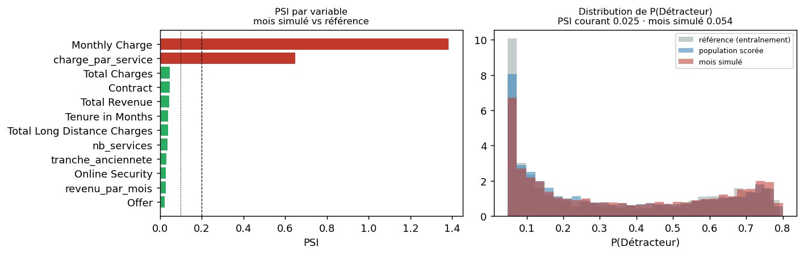
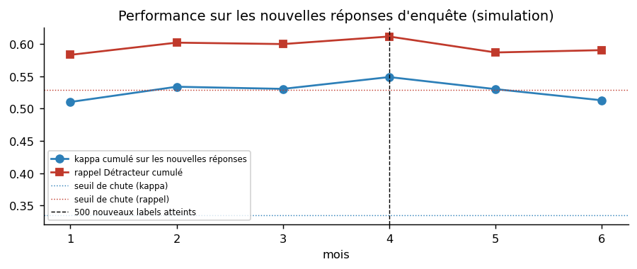

# Phase 6 — Déploiement

**En bref.** Le modèle est persisté d'un bloc (préprocessing + modèle + calibrateur) et consommé par
une application Streamlit de sept pages pour l'équipe rétention : liste d'appels priorisée, analyse
d'un client avec ses drivers et son levier, saisie manuelle tolérante aux inconnus, verbatim en
démonstration. Un monitoring implémenté surveille la dérive des entrées et des prédictions, la
performance sur les nouvelles réponses d'enquête, et déclenche le réentraînement sur seuil, volume ou
échéance. La décision demandée à la direction : **un groupe de contrôle non contacté** à la prochaine campagne.

## 1. Carte du modèle

| | |
|---|---|
| Nom | Prédiction de catégorie NPS — clients silencieux |
| Version | 1.1 · seed 42 · régénéré par `python -m src.run` |
| Modèle | logistique ordinale (Linéaire, classification ordinale), version réglée, dans un `Pipeline` scikit-learn (imputation + encodage + modèle) |
| Cible | M3 — Détracteur (satisfaction 1–2) · Passif (3) · Promoteur (4–5) |
| Données d'entraînement | 1080 répondants simulés (S3 — MNAR), IBM Telco 11.1.3+ |
| Évaluation | 5963 clients silencieux, vérité connue |
| Kappa quadratique · macro-F1 | 0.384 · 0.490 |
| Rappel / précision Détracteur | 0.63 / 0.44 |
| Décision | hybride — classe : modèle non calibré (la calibration écrasait la classe Passif) ; P(Détracteur) : modèle calibré (Platt), pour le classement des appels |
| Explication | coefficients × valeur (exact, additif) |
| Variables exclues | tout ce qui touche au churn, `CLTV`, démographie, géographie (phase 2 § 4) |
| Usage prévu | prioriser une liste d'appels de rétention mensuelle ; comprendre les drivers |
| Usage **interdit** | décider d'une offre ou d'un tarif individuel ; toute décision fondée sur un attribut protégé ; lire P(Détracteur) comme une fréquence |
| Limites connues | écart de rappel de 26 pts entre groupes d'âge (proxies) ; classe Passif mal rappelée ; probabilités surestimées ; propension à répondre simulée |
| Fichiers | `models/modele_final.joblib` (pipelines calibré, brut, de décision, métadonnées) · `data/processed/clients_scores.parquet` |

## 2. L'application — choix de conception (énoncé § 4.8)

`streamlit run app/app.py` · sept pages, adressables par `?page=` · toutes les valeurs sont lues dans
les artefacts du pipeline, rien n'est recopié.

| Page | Pour qui | Ce qu'elle permet |
|---|---|---|
| Synthèse | direction | les cinq chiffres, le NPS des silencieux, les trois résultats, la décision demandée |
| Prioriser les appels | équipe rétention | liste des silencieux classés par P(Détracteur), filtres, capacité K, pondération CLTV optionnelle, levier recommandé, export CSV |
| Analyser un client | conseiller | client existant ou saisie manuelle → classe, probabilités, drivers de *ce* client, levier ; verbatim collé (bonus, démonstration) |
| Données et cible | data / métier | exploration, qualité, registre de fuites, construction de la cible |
| Modèles et performance | data | catalogue justifié, grille, CV vs test, réglage, par classe, calibration, robustesse, fondation, texte |
| Drivers et équité | métier / CX | drivers globaux et par segment, leviers, audit par sous-groupe, proxies, mitigation |
| Suivi et méthode | data / direction | monitoring, carte du modèle, conformité à l'énoncé, reproductibilité |

**Pourquoi Streamlit** : l'énoncé demande une interface utilisable par un responsable rétention, pas une
API ; Streamlit livre une application complète en Python pur, sans front séparé, versionnable avec le
pipeline. Une API (FastAPI) serait la brique suivante pour intégrer le score au CRM — hors périmètre.

**Robustesse aux entrées** (exigence « behave gracefully ») : chaque champ de saisie accepte
« (inconnu) » ; le pipeline impute (médiane / mode) et `OneHotEncoder(handle_unknown='ignore')`
absorbe toute modalité jamais vue. Testé automatiquement (`test_modele_tolere_entrees_vides_et_modalites_inconnues`).

**Ce que l'application dit toujours** : les probabilités servent à classer, pas à lire une fréquence ;
les drivers sont des associations ; le modèle texte est une démonstration sur du texte synthétique.

**Performance** : modèle et données chargés une fois (`st.cache_resource`) ; explication d'un client
en moins d'une seconde pour les modèles linéaires et à arbres.

## 3. Reproductibilité et livraison

`python -m src.run` (données → cible → 15 modèles → sélection → évaluation) · `python -m src.fondation_eval` ·
`python -m src.verbatims` et `python -m src.texte` · `python -m src.monitoring` · `python -m src.rapports` ·
`python -m src.writeup` · `python -m pytest tests -q`. Seed unique ; aucune clé dans le dépôt (`.env` ignoré,
`.env.example` fourni) ; test à blanc depuis une copie vierge (phase 5 § 9).

## 4. Monitoring et réentraînement (énoncé § 4.9) — implémenté

**Référence** = population d'entraînement (répondants S3). **Courant** = population scorée. **Mois
simulé** = tarif +12 %, 15 % des contrats basculés en mensuel, 10 % migrés vers la fibre.

| | PSI des prédictions | Part de détracteurs prédits |
|---|---|---|
| Courant vs référence | 0.025 | 31.4% (réf. 32.9%) |
| Mois simulé vs référence | **0.054** | **36.4%** |

Variables les plus dérivantes — courant :

| Variable | PSI | Statut |
|---|---|---|
| Total Charges | 0.0482 | stable |
| Total Revenue | 0.0443 | stable |
| Monthly Charge | 0.0414 | stable |
| Tenure in Months | 0.0396 | stable |
| Total Long Distance Charges | 0.0385 | stable |
| nb_services | 0.0357 | stable |
| Internet Type | 0.0313 | stable |
| tranche_anciennete | 0.0301 | stable |

Variables les plus dérivantes — mois simulé :

| Variable | PSI | Statut |
|---|---|---|
| Monthly Charge | 1.3813 | ALERTE |
| charge_par_service | 0.6490 | ALERTE |
| Total Charges | 0.0482 | stable |
| Contract | 0.0475 | stable |
| Total Revenue | 0.0443 | stable |
| Tenure in Months | 0.0396 | stable |
| Total Long Distance Charges | 0.0385 | stable |
| nb_services | 0.0357 | stable |

**Déclencheur de dérive sur le mois simulé : DÉCLENCHÉ** (variables en alerte :
Monthly Charge, charge_par_service). Le mécanisme détecte une hausse tarifaire et une migration de contrats
que personne n'aurait signalées au modèle. Note : le PSI « courant » n'est pas nul alors que les deux
populations viennent de la même base — c'est le **biais de sélection S3** qui s'affiche, et c'est
exactement ce que le monitoring doit voir.

**Performance sur les nouvelles réponses d'enquête** (simulation : ~150 réponses par mois, tirées parmi les
silencieux selon la propension biaisée S3) :

| Mois | Nouvelles réponses | Cumul | Kappa (lot) | Rappel Dét. (lot) | Kappa (cumul) | Rappel Dét. (cumul) | Chute | Volume atteint |
|---|---|---|---|---|---|---|---|---|
| 1 | 150 | 150 | 0.510 | 0.583 | 0.510 | 0.583 |  |  |
| 2 | 150 | 300 | 0.556 | 0.622 | 0.534 | 0.602 |  |  |
| 3 | 150 | 450 | 0.523 | 0.595 | 0.531 | 0.600 |  |  |
| 4 | 150 | 600 | 0.600 | 0.641 | 0.549 | 0.612 |  | ✓ |
| 5 | 150 | 750 | 0.451 | 0.476 | 0.530 | 0.587 |  | ✓ |
| 6 | 150 | 900 | 0.420 | 0.609 | 0.513 | 0.591 |  | ✓ |

Référence : kappa 0.384, rappel 0.629. Seuils : chute de kappa > 0.05, chute de rappel
> 0.1, volume minimal 500 nouveaux labels (atteint au mois 4), échéance 6 mois.
Chute détectée sur la simulation : non. réponses tirées parmi les silencieux selon la propension S3 (les extrêmes répondent plus) : la performance sur les nouveaux répondants est donc optimiste par rapport à la base — exactement le biais que le monitoring réel subira.

**Ce qu'on surveille, et quand on réentraîne** :

| Signal | Mesure | Déclencheur |
|---|---|---|
| Dérive des entrées | PSI par variable, mensuel, vs population d'entraînement | PSI > 0,20 sur une variable majeure (`Contract`, `Tenure`, `Monthly Charge`) |
| Dérive des prédictions | PSI de P(Détracteur) ; part de Détracteurs prédits | PSI > 0,20 ou variation > 5 points sans cause métier connue |
| Performance réelle | kappa et rappel Détracteur sur les **nouvelles réponses d'enquête** | chute > 0,05 de kappa ou > 10 points de rappel |
| Équité | rappel Détracteur par tranche d'âge sur les nouvelles réponses | écart > 15 points |
| Volume de labels | nouvelles réponses reçues | réentraînement dès 500 nouveaux labels, au plus tard tous les 6 mois |
| Calibration | ECE sur les nouvelles réponses | recalibrer (Platt) sur les vraies réponses de la population cible dès 300 labels |

Outil recommandé en production : Evidently (rapports HTML autonomes), cité par l'énoncé ; ici le PSI
est implémenté directement pour rester sans dépendance.

## 5. La boucle de rétroaction — et la décision demandée

Un détracteur appelé puis retenu **change de classe**. Si on réentraîne sur ces données, le modèle
apprend l'effet de sa propre intervention comme s'il s'agissait d'une propriété du client. Il se
dégrade, et personne ne voit pourquoi. Trois parades, par ordre de coût :

1. **Journaliser chaque contact** (qui, quand, quel levier, quelle issue) et exclure du réentraînement
   les réponses postérieures à un contact, ou les traiter comme une strate séparée.
2. **Ne pas contacter 10 à 20 % des clients ciblés, tirés au hasard**, à chaque campagne. Ce groupe de
   contrôle coûte quelques clients non retenus et achète deux choses irremplaçables : la mesure de
   l'effet réel de la campagne, et les données d'un modèle d'**uplift** au cycle suivant — passer du
   ciblage par *risque* (cette étude) au ciblage par *sensibilité* (Ascarza 2018).
3. À terme, réentraîner sur les non-contactés et les contrôles seulement.

> **La décision demandée à la direction** : autoriser le groupe de contrôle dès la prochaine campagne.
> C'est le seul passage de l'étude qui demande une décision plutôt que de présenter un résultat.

## Décisions prises dans cette phase

| Décision | Justification | Où c'est vérifié |
|---|---|---|
| Persistance d'un bloc : pipelines calibré, brut, de décision + métadonnées | rejouable sans réentraînement ; l'application n'a aucune logique de préparation | § 1, `models/modele_final.joblib` |
| Streamlit, sept pages, contenu lu dans les artefacts | interface pour un responsable rétention ; aucune valeur recopiée | § 2 |
| Tolérance aux inconnus par le pipeline, pas par l'interface | un seul endroit à tester | § 2, test dédié |
| Monitoring : PSI + performance sur nouvelles réponses + volume + échéance | les quatre déclencheurs de l'énoncé | § 4 |
| Groupe de contrôle recommandé | seule façon de mesurer l'effet et d'éviter la boucle de rétroaction | § 5 |
